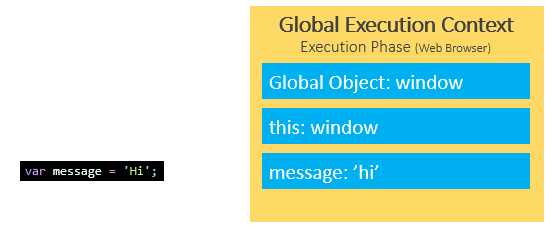
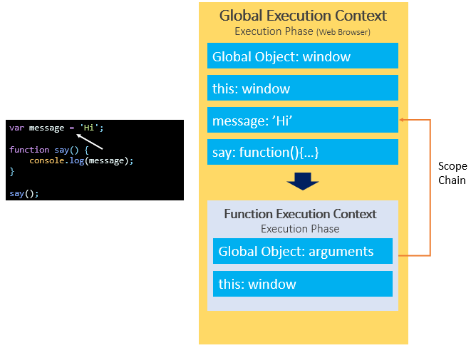

# JavaScript Variable Scopes

## What is variable scope

- **Scope determines the visibility and accessibility of a variable**.
- JavaScript has three scopes:

  1. global scope,

  2. local scope, and
  3. block scope.

## Global scope

- When you execute a script(for the first time), the **JavaScript engine** creates a **global execution context.**

- It also assigns variables that you declare outside of functions to the global execution context. These variables are in the global scope. They are also known as **global variables.**

```js
var message = "Hi";
```

- The variable _message_ is global scoped. It can be accessible everywhere in the script.



## Local scope

- Variables that you **declare inside a function** are local to the function. They are called **local variables.**


## Scope chain

```js
var message = "Hi";

function say() {
  console.log(message);
}

say();
```

- Behind the scenes, JavaScript performs the following:
  - Look up the variable message in the current context (function execution context) of the say() function. It cannot find any.
  - Find the variable message in the outer execution context which is the global execution context. It finds the variable message.

`The way that JavaScript resolves a variable is by looking at it in its current scope, if it cannot find the variable, it goes up to the outer scope, which is called the scope chain.`


## Global variable leaks: the weird part of JavaScript

```js
function getCounter() {
  counter = 10;
  return counter;
}

console.log(getCounter()); // 10
```

- In this example, we assigned 10 to the counter variable **without the var, let, or const keyword** and then returned it.
- **This issue is known as the leaks of the global variables.**
- Under the hood, the JavaScript engine first looks up the counter variable in the local scope of the getCounter() function. Because there is no var, let, or const keyword, the counter variable is not available in the local scope. It hasn’t been created.
- Then, the JavaScript engine follows the scope chain and looks up the counter variable in the global scope. The global scope also doesn’t have the counter variable, **so the JavaScript engine creates the counter variable in the global scope.**
- To fix this _“weird”_ behavior, you use the **'use strict'** at the top of the script or at the top of the function:

```js
"use strict";

function getCounter() {
  counter = 10;
  return counter;
}

console.log(getCounter()); // ReferenceError: counter is not defined
```

- The following shows how to use the 'use strict' in the function:

```js
function getCounter() {
  "use strict";
  counter = 10;
  return counter;
}

console.log(getCounter());
```

## Block scope

- ES6 provides the let and const keywords that allow you to declare variables in block scope.

Generally, whenever you see curly brackets {}, it is a block. It can be the area within the if, else, switch conditions or for, do while, and while loops.

```js
function say(message) {
  if (!message) {
    let greeting = "Hello"; // block scope
    console.log(greeting);
  }
  // say it again ?
  console.log(greeting); // ReferenceError
}

say();
```
