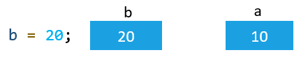

# JavaScript data types and data structures

- Programming languages all have built-in data structures, but these often differ from one language to another.
- JavaScript provides different data types to hold different types of values.

## JavaScript Types are Dynamic,

- JavaScript is a loosely typed and dynamic language.
- JavaScript is a **"dynamic type" language,** means you don't need to specify type of the variable because it is dynamically used by JavaScript engine.
- Variables in JavaScript are not directly associated with any particular value type, and any variable can be assigned (and re-assigned) values of all types.
- To be able to operate on variables, it is important to know something about the type of the varibale.

```
let value = 3.6
console.log(value + " -> " + typeof value) // 3.6 -> number
value = "Hello world!"
console.log(value + " -> " + typeof value)  // Hello world! -> string 
value = true
console.log(value + " -> " + typeof value)  // true -> boolean
value = null
console.log(value + " -> " + typeof value)  // null -> object
value = undefined
console.log(value + " -> " + typeof value)  // undefined -> undefined 

```

`NOTE: When adding a number and a string, JavaScript will treat the number as a string.(Coersion)`

- JavaScript evaluates expressions from left to right. Different sequences can produce different results

```
  let x = 16 + 4 + "Volvo"; //20Volvo
  let x = "Volvo" + 16 + 4; //Volvo164
```

## JavaScript types

- The set of types in the JavaScript language consists of primitive values and objects.
- Primitive values (immutable datum represented directly at the lowest level of the language)
  - Boolean type
  - Null type
  - Undefined type
  - Number type
  - BigInt type
  - String type
  - Symbol type
- Objects (collections of properties)

## Primitive Type / Value Type

- In JavaScript, a primitive (primitive value, primitive data type) is data that is **not an object and has no methods.**
- There are 7 primitive data types:

  1. string,
  2. number,
  3. bigint,
  4. boolean,
  5. undefined,
  6. symbol, and
  7. null.

- We refer to values of these types as "primitive values".
- Most of the time, a primitive value is represented directly at the lowest level of the language implementation.

- All primitives are **immutable**, i.e., they cannot be altered.

`It is important not to confuse a "primitive" itself with a "variable" assigned a primitive value. The variable may be reassigned a new value, but the existing value can not be changed in the ways that objects, arrays, and functions can be altered.`

> > **This example will help you understand that primitive values are immutable**

`Using a "string method" doesn't mutate the string. It will always return a new string`

```
const name = "prabhash";
console.log(name);              // prabhash
const upperName= name.toUpperCase();
console.log(upperName)          // PRABHASH
console.log(name);              // prabhash
```

`Using an array method can mutates the array`

```
var foo = [];
console.log(foo);               // []
foo.push("plugh");
console.log(foo);               // ["plugh"]
```

`A primitive can be replaced, but it can't be directly altered.i.e We can reassign a new value to the same varibale`

```
let name = "prabhash";
console.log(name);        // prabhash
name = name.toUpperCase();
console.log(name);        // PRABHASH
```

## Primitive wrapper objects in JavaScript

- **_Except for null and undefined_**, all primitive values have object equivalents that wrap around the primitive values:

  - **_String_** for the string primitive.
  - **_Number_** for the number primitive.
  - **_BigInt_** for the bigint primitive.
  - **Boolean** for the boolean primitive.
  - **Symbol** for the symbol primitive.

- The **primitive wrapper types** make it easier to use primitive values including booleans, numbers, and strings.

```
let language = 'JavaScript';
let s = language.substring(4);
console.log(s);  // Script
```

> In this example, The variable **language** holds a **primitive string value**. It doesn’t have any method like substring(). **_However, the above code works perfectly._**

- When you **call a method on a variable** that holds a **number, a string, or a boolean**, JavaScript performs the following steps behind the scenes:
  1. **Create an object** of a corresponding type.
  2. **Call a specific method** on the instance.
  3. **Delete the instance immediately.**

So the following code

```
let language = 'JavaScript';
let str = language.substring(4);
```

is technically equivalent to the following code:

```
let language = 'JavaScript';
// behind the scenes of the language.substring(4);
let temp = new String(language);
str = temp.substring(4);
temp = null;
console.log(str)  // Script
```

`Now the question is, if JS behind the scene using Constructor Function to create primitive value, why not we ourselve do the same in the frist place??`

### Primitive wrapper types vs. reference types

- When you create an object of a reference type using the new operator, the object will stay in the memory until it goes out of scope.

> The following variable s will stay on the heap until it goes out ofthe scope:

```
let s = new String('JavaScript');
console.log(s);
```

> However, an automatically created primitive wrapper object exists for one line of code only. See the following example:

```
let s = 'JavaScript';
s.language = 'ECMAScript';
console.log(s.language); // undefined
```

- In this example, we attempted to access the language property of the **_s variable_** and received a value of **_undefined instead of 'ECMAScript'._**
- The reason is that the following code creates a String object and assigns a value to the language property.

```
s.language = 'ECMAScript';
```

However, the String object with the language property only exists during the execution of this line of code.

> It’s **_not recommended_** to explicitly create primitive wrapper objects like the following:

```
let n = new Number(10);
let s = new String('JS');
let b = new Boolean(false);
```

- The wrapper's valueOf() method returns the primitive value.

## Objects / reference type

- In computer science, an object is a value in memory which is possibly referenced by an identifier.
- In JavaScript, objects can be seen as a collection of properties.
- With the **object literal syntax,** a limited set of properties are initialized; then properties can be added and removed.
- Property values can be values of any type, including other objects, which enables building complex data structures.
- Properties are identified using key values. A key value is either a String value or a Symbol value.
- There are two types of object properties: The data property and the accessor property.

```
Note: Each property has corresponding attributes. Attributes are used internally by the JavaScript engine, so you cannot directly access them. That's why attributes are listed in double square brackets, rather than single.
```

## "Normal" objects, and functions

- A JavaScript object is a mapping between keys and values. Keys are strings (or Symbols), and values can be anything.
- Functions are regular objects with the additional capability of being callable.

## Determining types using the typeof operator

- The typeof operator returns the type of a variable or an expression:

## Udefined vs Empty value

- Undefined:

  - In JavaScript, a variable without a value, has the value undefined.
  - The type is also undefined.
  - Any variable can be emptied, by setting the value to undefined. The type will also be undefined.

- Empty Values: let car = "";

  - An empty value has nothing to do with undefined.

  - An empty string has both a legal value and a type.

| Type                | Result                          |
| ------------------- | ------------------------------- |
| Undefined undefined |
| Null                | object\*                        |
| Boolean boolean     |
| Number              | number                          |
| BigInt              | (new in ECMAScript 2020) bigint |
| String              | string                          |
| Symbol              | (new in ECMAScript 2015) symbol |
| Function            | object function                 |
| Any other object    | object                          |

`*Null - Why does the typeof null return object? When JavaScript was first implemented, values were represented as a type tag and a value. The objects type tag was 0 and the NULL pointer (0x00 in most platforms) consequently had 0 as a type tag as well. A fix was proposed that would have made typeof null === 'null', but it was rejected due to legacy code that would have broken.`

```
// Numbers
typeof 37 === "number";
typeof 3.14 === "number";
typeof 42 === "number";
typeof Math.LN2 === "number";
typeof Infinity === "number";
typeof NaN === "number"; // Despite being "Not-A-Number"
typeof Number("1") === "number"; // Number tries to parse things into numbers
typeof Number("shoe") === "number"; // including values that cannot be type coerced to a number

typeof 42n === "bigint";

// Strings
typeof "" === "string";
typeof "bla" === "string";
typeof `template literal` === "string";
typeof "1" === "string"; // note that a number within a string is still typeof string
typeof typeof 1 === "string"; // typeof always returns a string
typeof String(1) === "string"; // String converts anything into a string, safer than toString

// Booleans
typeof true === "boolean";
typeof false === "boolean";
typeof Boolean(1) === "boolean"; // Boolean() will convert values based on if they're truthy or falsy
typeof !!1 === "boolean"; // two calls of the ! (logical NOT) operator are equivalent to Boolean()

// Symbols
typeof Symbol() === "symbol";
typeof Symbol("foo") === "symbol";
typeof Symbol.iterator === "symbol";

// Undefined
typeof undefined === "undefined";
typeof declaredButUndefinedVariable === "undefined";
typeof undeclaredVariable === "undefined";

// Objects
typeof { a: 1 } === "object";

// use Array.isArray or Object.prototype.toString.call
// to differentiate regular objects from arrays
typeof [1, 2, 4] === "object";

typeof new Date() === "object";
typeof /regex/ === "object"; // See Regular expressions section for historical results

// The following are confusing, dangerous, and wasteful. Avoid them.
typeof new Boolean(true) === "object";
typeof new Number(1) === "object";
typeof new String("abc") === "object";

// Functions
typeof function() {} === "function";
typeof class C {} === "function";
typeof Math.sin === "function";
```

`Undefined vs Null: Undefined is the absence of definition, it has yet to be defined, and null is the absence of value, there is no value there.`

## Primitive vs Non Primitive

- Primitive - Primitive values are defined by being immutable, they cannot be altered. The variable assigned to a primitive type may be reassigned to a new value, but the original value can not be changed in the same way objects can be modified. Primitives are passed by value, meaning their values are copied and then placed somewhere else in the memory. They are also compared by value. There are currently 7 primitive data types in JavaScript.
  - string
  - number
  - bigint
  - boolean
  - null
  - undefined
  - symbol
- Non Primitive - The only type that leaves us with is objects. Objects are able to be mutated and their properties are passed by reference, meaning their properties are not stored separately in memory. A new variable pointing to an object will not create a copy, but reference the original objects location in memory. Therefore, changing the 2nd object will also change the first.

```
// objects are passed by reference
let obj = {
  name: "object 1"
};
let newObj = obj; // points to same place in memory as obj
newObj.name = "newObj"; // modifies the memory
// Since both point to the same place...
console.log(obj); // {name: newObj}
console.log(newObj); // {name: newObj}
// They are both modified.

let arr = [1, 2, 3];
let newArr = arr;
newArr.push(4);
console.log(arr); // [1, 2, 3, 4]
console.log(newArr); // [1, 2, 3, 4]
```

- There are two ways to get around this, Object.assign() or use the spread operator {...} to "spread" or expand the object into a new variable. By doing this, it will allow the new variable to be modified without changing the original. However, these only create a "shallow copy".
  > **Shallow copy:** Shallow copy is a bit-wise copy of an object. A new object is created that has an exact copy of the values in the original object. If any of the fields of the object are references to other objects, just the reference addresses are copied i.e., only the memory address is copied.

> **Deep copy:** A deep copy copies all fields, and makes copies of dynamically allocated memory pointed to by the fields. A deep copy occurs when an object is copied along with the objects to which it refers.

```
const originalObj = {
  nested: {
    nestedKey: "nestedValue"
  },
  key: "value"
};
// originalObj points to location 1 in memory
const assignObj = originalObj;
// assignObj will point to 1 in memory
const shallowObj = { ...originalObj };
// shallowObj points to a new location 2, but references location 1 for the nested object
const deepObj = JSON.parse(JSON.stringify(originalObj));
// deepObj clones all parts of the object to a new memory address
```


```
const originalObj = {
  nested: {
    nestedKey: "nestedValue"
  },
  key: "value"
};
const assignObj = originalObj;
const shallowObj = { ...originalObj };
const deepObj = JSON.parse(JSON.stringify(originalObj));

console.log("originalObj: ", originalObj);
console.log("assignObj: ", assignObj);
console.log("shallowObj: ", shallowObj);
console.log("deepObj: ", deepObj);

/*
originalObj: {nested: {
                nestedKey: "changed value"
                },
              key: "changed value"}

assignObj: {nested: {
                nestedKey: "changed value"
                },
              key: "changed value"}

shallowObj: {nested: {
                nestedKey: "changed value"
                },
              key: "value"}

deepObj: {nested: {
                nestedKey: "nestedValue"
                },
              key: "value"}
*/
```

> Nifty Snippet: If you try to check if 2 objects with the same properties are equal with obj1 = obj2, it will return false. It does this because each object has its own address in memory as we learned about. The easiest way to check the contents of the objects for equality is this.

```
JSON.stringify(obj1) === JSON.stringify(obj2);
```

- This will return true if all the properties are the same.

## Static vs Dynamic Typed

- The major difference between static and dynamic typed languages is when the types of variables are checked. Static typed languages (Java, C, C++, C#) are checked during the compile stage, so all types are known before run-time. Dynamic languages (JavaScript, PHP, Python, Ruby, Perl) are checked on the fly, during the execution stage. Also, after dividing the languages into dynamic and static, they are then divided again into strong and weak typed. Weakly typed (JavaScript, PHP, C, C++) languages can make type coercions implicitly while strongly typed (Python, Ruby, C#, Java) do not allow conversions between unrelated types.


## Accessing by value and reference

- JavaScript provides six primitive types as undefined, null, boolean, number, string, and symbol , and a reference type object.
- The size of a primitive value is fixed, **therefore, JavaScript stores the primitive value on the stack.**
- On the other hand, the size of a reference value is dynamic so **JavaScript stores the reference value on the heap.**
- When you assign a value to a variable, the JavaScript engine will determine whether the value is a primitive or reference value.
- If the value is a primitive value, when you access the variable, you manipulate the actual value stored in that variable. In other words, the variable that stores a primitive value is accessed by value.
- Unlike a primitive value, when you manipulate an object, you work on the reference of that object, rather than the actual object. It means a variable that stores an object is accessed by reference.
- To determine the type of a **primitive value** you use the **typeof operator.**
- To find the **type of a reference value**, you use the **instanceof operator:**

```
let refType = variable instanceof constructor;
```

> For example, the following rgb variable is an instance of the Array object:

```
let rgb = ['red','green','blue'];
console.log(rgb instanceof Array); // true
console.log(rgb instanceof Object); // true
console.log(typeof rgb)           // object
```

### **Copying primitive values**

- When you assign a variable that stores a **primitive value** to another, the value stored in the variable is **created and copied into the new variable.**

```
var a = 10;
var b = a;  // Internally, JavaScript engine copies the value stored in  a into the location of b.
```


> assign the variable b new value 20.

```
b = 20;
```



`Since a and b have no relationship, when you change the value stored in the b variable, the value of the a variable doesn’t change.`

### **Copying reference values**

- When you assign a reference value from one variable to another, the value stored in the variable is also copied into the location of the new variable.
- The **difference** is that the **values stored in both variables now are the address of the actual object stored on the heap**. As a result, **both variables are referencing the same object.**

```
var x = {name: 'John'};
var y = x;
```

Both x and y are now referencing the same object on the heap.


> **modify** the value stored in the name property of the object using the y variable.


`Since both x and y are referencing the same object, the change is also reflected if you access the object using the x variable.`
