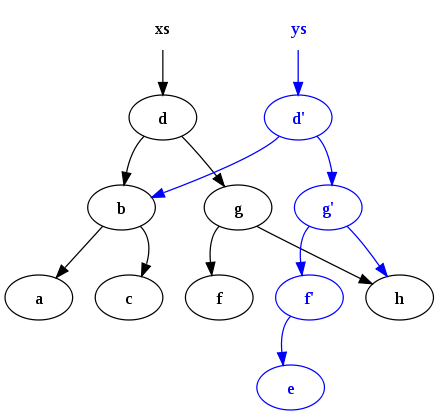
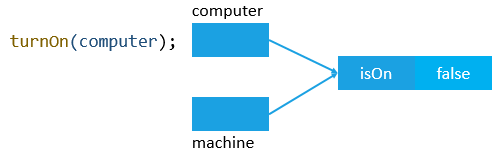
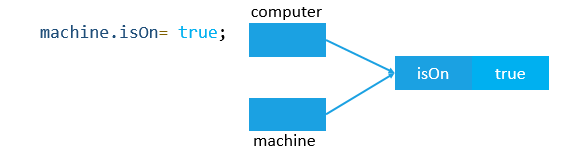

# JS Function

- Functions are reusable blocks of code that you can write once and run again and again, saving the need to keep repeating code all the time.
- code inside functions runs in a separate scope than code outside functions

- A JavaScript function is a block of code designed to perform a particular task.

- A JavaScript function is executed when "something" invokes it (calls it).

```
function name(parameter1, parameter2, parameter3) {
// code to be executed
}

This form of creating a function is also known as function declaration. It is always hoisted, so you can call function above function definition and it will work fine.
```

- **Function parameters** are listed inside the parentheses () in the function definition.

- **Function arguments** are the values received by the function when it is invoked.

- Inside the function, the arguments (the parameters) behave as local variables.

## Built-in browser functions

- The JavaScript language has many built-in functions to allow you to do useful things without having to write all that code yourself.
- In fact, some of the code you are calling when you invoke a built in browser function couldn't be written in JavaScript — many of these functions are calling parts of the background browser code, which is written largely in low-level system languages like C++, not web languages like JavaScript.

- Bear in mind that some built-in browser functions are not part of the core JavaScript language — some are defined as part of browser APIs, which build on top of the default language to provide even more functionality.

## Anonymous functions & Function Expression

- you can also create a function that doesn't have a name:

```
function() {
  alert('hello');
}
```

- This is called an anonymous function — it has no name!
- It also won't do anything on its own. You generally use an anonymous function along with an event handler,
- You can also assign an anonymous function to be the value of a variable, for example:

```
const myGreeting = function() {
  alert('hello');
}

This form of creating a function is also known as function expression. Unlike function declaration, function expressions are not hoisted.
```

- This effectively gives the function a name; you can also assign the function to be the value of multiple variables, for example:

```
let anotherGreeting = myGreeting;
```

- This function could now be invoked using either of:

```
myGreeting();
anotherGreeting();
```

## Function parameters

- Some functions require parameters to be specified when you are invoking them — these are values that need to be included inside the function parentheses, which it needs to do its job properly.
- Parameters are sometimes called arguments, properties, or even attributes.
- It should also be noted that sometimes parameters are optional — you don't have to specify them. If you don't, the function will generally adopt some kind of default behavior.As an example, the array join() function's parameter is optional:
- Starting with ECMAScript 2015, there are two new kinds of parameters: default parameters and rest parameters.

#### **Default parameters**

- In JavaScript, parameters of functions default to undefined. However, in some situations it might be useful to set a different default value. This is exactly what default parameters do.

```
- Without default parameters

In JavaScript, parameters of functions default to undefined. However, in some situations it might be useful to set a different default value. This is exactly what default parameters do.

function multiply(a, b) {
  b = typeof b !== 'undefined' ?  b : 1;

  return a * b;
}

multiply(5); // 5

```

```
With default parameters (post-ECMAScript 2015)
With default parameters, a manual check in the function body is no longer necessary. You can put 1 as the default value for b in the function head:

function multiply(a, b = 1) {
  return a * b;
}

multiply(5); // 5
```

#### **Rest parameters**

- The rest parameter syntax allows us to represent an indefinite number of arguments as an array.

```
In the following example, the function multiply uses rest parameters to collect arguments from the second one to the end. The function then multiplies these by the first argument.

function multiply(multiplier, ...theArgs) {
  return theArgs.map(x => multiplier * x);
}

var arr = multiply(2, 1, 2, 3);
console.log(arr); // [2, 4, 6]
```

## Functions versus methods

## Function Hoisting

- Hoisting is JavaScript's default behavior of moving **declarations** to the top of the current scope.

- **Hoisting applies to variable declarations and to "function declarations".**

- Because of this, JavaScript functions can be called before they are declared:

- **Functions defined using an expression are not hoisted.**

## Function scope and conflicts:

- . When you create a function, the variables and other things defined inside the function are inside their own separate scope, meaning that they are locked away in their own separate compartments, unreachable from code outside the functions.
- The top level outside all your functions is called the **global scope**. Values defined in the global scope are accessible from everywhere in the code.
- JavaScript is set up like this for various reasons — but mainly because of **security and organization.** Sometimes you don't want variables to be accessible from everywhere in the code — external scripts that you call in from elsewhere could start to mess with your code and cause problems because they happen to be using the same variable names as other parts of the code, causing conflicts. This might be done maliciously, or just by accident.
- It is a bit like a zoo. The lions, zebras, tigers, and penguins are kept in their own enclosures, and only have access to the things inside their enclosures — in the same manner as the function scopes. If they were able to get into other enclosures, problems would occur.
- The zoo keeper is like the global scope — they have the keys to access every enclosure, to restock food, tend to sick animals, etc.

```
Note:
  The same scoping rules do not apply to loop (e.g. for() { ... }) and conditional blocks (e.g. if() { ... }) — they look very similar, but they are not the same thing!

```

## Functions inside functions

- Keep in mind that you can call a function from anywhere, even inside another function.
- This is often used as a way to keep code tidy — if you have a big complex function, it is easier to understand if you break it down into several sub-functions:

```
function myBigFunction() {
  let myValue;

  subFunction1();
  subFunction2();
  subFunction3();
}

function subFunction1() {
  console.log(myValue);
}

function subFunction2() {
  console.log(myValue);
}

function subFunction3() {
  console.log(myValue);
}

Just make sure that the values being used inside the function are properly in scope.
```

- The example above would throw an error ReferenceError: myValue is not defined, because although the myValue variable is defined in the same scope as the function calls, it is not defined inside the function definitions — the actual code that is run when the functions are called.
- To make this work, you'd have to pass the value into the function as a parameter, like this:

```
function myBigFunction() {
  let myValue = 1;

  subFunction1(myValue);
  subFunction2(myValue);
  subFunction3(myValue);
}

function subFunction1(value) {
  console.log(value);
}

function subFunction2(value) {
  console.log(value);
}

function subFunction3(value) {
  console.log(value);
}
```

## Function return values

- Some functions don't return a significant value, but others do. It's important to understand what their values are, how to use them in your code, and how to make functions return useful values.

---

## Different types of functions

### Anonymous Function

- An anonymous function is a function without a function name.
- Only function expressions can be anonymous, function declarations must have a name.

```
// When used as a function expression
(function () {});
// or using the ECMAScript 2015 arrow notation
() => {};
```

### Named Function

- A named function is a function with a function name:

```
// Function declaration
function foo() {};

// Named function expression
(function bar() {});

// or using the ECMAScript 2015 arrow notation
const foo = () => {};
```

### Inner and Outer Function:

- An inner function is a function inside another function (square in this case).
- An outer function is a function containing a function

```
function addSquares(a,b) {
   function square(x) {
      return x * x;
   }
   return square(a) + square(b);
};
//Using ECMAScript 2015 arrow notation
const addSquares = (a,b) => {
   const square = x => x*x;
   return square(a) + square(b);
};
```

### Recursive Function

- A recursive function is a function that calls itself.

```
function loop(x) {
   if (x >= 10)
      return;
   loop(x + 1);
};
//Using ECMAScript 2015 arrow notation
const loop = x => {
   if (x >= 10)
      return;
   loop(x + 1);
};
```

### Immediately Invoked Function Expressions (IIFE)

- function that is called directly after the function is loaded into the browser’s compiler.
- The way to identify an IIFE is by locating the extra left and right parenthesis at the end of the function’s definition.
- Function expressions can be made "self-invoking".
- A self-invoking expression is invoked (started) automatically, without being called.
- You cannot self-invoke a function declaration. You have to add parentheses around the function to indicate that it is a function expression:

```
(function () {
let x = "Hello!!";  // I will invoke myself
})();
```

## Functions are Objects

- The typeof operator in JavaScript returns "function" for functions.

- But, JavaScript functions can best be described as objects.

- JavaScript functions have both properties and methods.

- The arguments.length property returns the number of arguments received when the function was invoked:

```
function myFunction(a, b) {
  return arguments.length;
}
```

## Arrow function

- Arrow functions allows a short syntax for writing "function expressions".

- You don't need the function keyword, the return keyword, and the curly brackets.

```
        // ES5
        var x = function(x, y) {
        return x * y;
        }

        // ES6
        const x = (x, y) => x * y;
```

- Arrow functions do not have their own "this". With arrow functions there are no binding of this.
  They are not well suited for defining object methods.

- Arrow functions are NOT hoisted. They must be defined before they are used.

- Using "const" is safer than using var, because a function expression is always constant value.

- You can only omit the return keyword and the curly brackets if the function is a single statement. Because of this, it might be a good habit to always keep them:

---

## First Class Function

- A programming language is said to have First-class functions when functions in that language are treated like any other variable. For example, in such a language, a function can be passed as an argument to other functions, can be returned by another function and can be assigned as a value to a variable.
- JavaScript treat function as a **first-class-citizens.** This means that functions are simply a value and are just another type of object.

#### **EXAMPLE | Assign a function to a variable**

```


const foo = function() {
   console.log("foobar");
}

// Invoke it using the variable
foo();

We assigned an Anonymous Function in a Variable, then we used that variable to invoke the function by adding parentheses () at the end.

Even if your function was named, you can use the variable name to invoke it. Naming it will be helpful when debugging your code. But it won't affect the way we invoke it.

```

#### **EXAMPLE | Pass a function as an Argument**

```
function sayHello() {
  return "Hello, ";
}

function greeting(helloMessage, name) {
 console.log(helloMessage() + name);  // Hello, JavaScript
}

// Pass `sayHello` as an argument to `greeting` function
greeting(sayHello, "JavaScript!");

```

```
The function that we pass as an argument to another function, is called a **Callback function**. sayHello is a Callback function.
```

#### **EXAMPLE | Return a function**

```
function sayHello() {
   return function() {
      console.log("Hello!");
   }
}

In this example; We need to return a function from another function - We can return a function because we treated function in JavaScript as a value.
```

```
A function that returns a function is called a Higher-Order Function.


Higher-Order Function: A function that receives another function as an argument or that returns a new function or both is called Higher-order functions. Higher-order functions are only possible because of the First-class function.

Note: Functions such as filter(),map(),reduce(),some() etc, these all are example of Higher-Order Functions.
```

- Now, we need to invoke sayHello function and its returned Anonymous Function. To do so, we have two ways:
  1. Using a Varibale

```
const sayHello = function() {
   return function() {
      console.log("Hello!");
   }
}
const myFunc = sayHello();
myFunc();

You have to use another variable. If you invoked sayHello directly, it would return the function itself without invoking its returned function.
```

2. Using double parentheses

```
function sayHello() {
   return function() {
      console.log("Hello!");
   }
}
sayHello()();
```

#### **Key Differences between First-Order Function and Higher-Order Function:-**

| First-Order Function                                                                                    | Higher-Order Function                                                                                        |
| ------------------------------------------------------------------------------------------------------- | ------------------------------------------------------------------------------------------------------------ |
| Function are treated as a variable that can be assigned to any other variable or passed as an argument. | Function receives another function as an argument or returns First-order a new function or both.             |
| The “first-class” concept only has to do with functions in programming languages.                       | The “higher-order” concept can be applied to functions in general, like functions in the mathematical sense. |
| The presence of the First-class function implies the presence of a higher-order function.               | The presence of a Higher-order function does not imply the presence of a First-order function.               |

---

## Functions properties

- Each function has two properties: **length and prototype.**
  - The length property determines the number of named arguments specified in the function declaration.
  - The prototype property references the actual function object

```
function swap(x, y) {
    let tmp = x;
    x = y;
    y = tmp;
}

console.log(swap.length); // 2
console.log(swap.prototype); // Object{}
```

> Typically, a function is invoked like a callable function. For example:

```
function fn() {
   // ...
}

fn();
```

> And function can be called as a constructor to create a new object:

```
function fn() {
   // ...
}

let f  = new fn();
```

`ES6 added a new property called target.new that allows you to detect whether a function ( fn) is called as a normal function ( fn()) or as a constructor using the new operator ( new fn()).`

- If a function is called normally ( f()), the new.target will be undefined.
- On the other hand, if the function is called using the new keyword, the new.target will reference the constructor:

```
function fn() {
    console.log(new.target);
}

fn(); // undefined
let f = new fn(); // [Function: fn]
```

---

## Function methods: apply(), call() , and bind()

```
const nameobj = {
firstName: "Prabhash",
lastName: "Ranjan",
age: 31,
summary() {
console.log(`${this.firstName} ${this.lastName} is of age ${this.age}`);
},
};

const newNameobj = {
firstName: "Rahul",
lastName: "Kumar",
age: 30,
};

const newNameobj2 = {
firstName: "Sunil",
lastName: "kumar",
age: "28",
};

// this method can be used as method of many different objects
const summ = nameobj.summary;
```

- here summ is function..and inside summ "this" is undefined..
- this method has no idea which object it is refering to when you call that method on its own
- we have to tel JS explicitly or manually what "this" keyword whould look like.
- there are 3 functions methods for that:
  1. call : It is used to call a function contains this value and an argument list.
  2. apply: It is used to call a function contains this value and a single array of arguments.
  3. bind : It is used to create a new function.

```
  summ() //ERROR
```

- call(pointing which obj to refer...and then pass all the arguments if any)

```
  summ.call(newNameobj);
```

- apply(it is similar to call but it takes aruments as a array)(not used much anymore)

- bind()
  - Bind does not immediatly call the function..but it gives a new function with :this binded
  - this is easily that "call" as we dont have to use call again and again each time
  - now we have binded version of function...

```
const bindSumm = summ.bind(newNameobj);
bindSumm(); // Rahul Kumar is of age 30 // we can pass argument in this function if any
```

- we can also bind the argument during binding phase..
- this way those argument is fixed

```
 ex: const bindSum = summ.bind(newNameobj, agument1) // whenever we call bindSum..first argument is fixed = argument1
```

### The apply() and call() methods

- The apply() and call() methods call a function with a given this value and arguments.
- The difference between the apply() and call() is that you need to pass the arguments to the apply() method as an array-like object, whereas you pass the arguments to the call() function individually.

```
let cat = {type: 'Cat', sound: 'Meow'};
let dog = {type: 'Dog', sound: 'Woof'};

let say = function (greeting) {
    console.log(greeting);
    // access current this
    console.log(this.type + ' says ' + this.sound);
};

say.apply(cat, ['Hi']);
// Hi
// Cat says Meow

say.apply(dog,['Hi']);
// Hi
// Dog says Woof


// The call() method is similar to the apply() method except for the way you pass the arguments:
say.call(cat,'Hi');
// Hi
// Cat says Meow
say.call(dog,'Hi');
// Hi
// Dog says Woof
```

### The bind() method

- The bind() method creates a new function instance whose this value is bound to the object that you provide.

```
let car = {
    speed: 5,
    start: function() {
        console.log('Start with ' + this.speed + ' km/h');
    }
};

let aircraft = {
    speed: 10,
    fly: function() {
        console.log('Flying');
    }
};
```

The aircraft has no start() method. To start an aircraft, you can use the bind() method of the start() method of the car object:

```
let taxiing = car.start.bind(aircraft);
```

In this statement, we change the this value inside the start() method of the car object to the aircraft object. The bind() method returns a new function that is assigned to the taxiing variable.

```
taxiing();  //Start with 10 km/h
```

`As you can see, the bind() method creates a new function that you can execute later while the call() method executes the function immediately. This is the main difference between the bind() and call() methods.`

- Technically, the aircraft object borrows the start() method of the car object via the bind(), call() or apply() method.

`For this reason, the bind(), call(), and apply() methods are also known as borrowing functions.`

---

## clousure

- A function has access to the varibale enviormen(VE) of the EXECUSION CONTEXTin which itwas created
- Closure:VE attacthedto the function,exactlyas it wasat the timeand place the function was created.- - Closure scope has PRIORITY over scope-chain

## Callable Object

- Because functions are objects in JavaScript, this also gives them the ability to have properties added to them. This creates a callable object, a special object that creates properties not available on normal objects. Below is a visualization of how this works under the hood. This code can not be ran in the console, but it is a representation of how the object looks.

```
function say() {
  console.log('say something')
}

say.yell = 'yell something'

// under the hood visual
// will not run or show in console
const funcObj = {
  // name will not exist if anonymous
  name: 'say',
  // code to be ran
  (): console.log('say something')
  // properties get added
  // apply, arguments, bind, call, caller, length, name, toString
  yell: 'yell something',
}

// with an obj
const obj = {
  // nothing gets created
}
```

> Nifty snippet: You might hear people say "Functions are first-class citizens in JavaScript". All this means is that functions can be passed around as if they were a JavaScript type. Anything that can be done with other 7n hhb , can also be done with functions. This introduces JavaScript to a whole different type of programming called functional programming. Below are some examples of how functions work differently in JavaScript.

```
// setting functions to variables
var setFuncToVar = function () {}
// call function within another
function a(fn) {
  fn()
}
a(function () {console.log('a new function')}
// return functions within another
function b() {
  return function c() {console.log('another func')}
}
```

## Higher Order Functions

- A Higher Order Function (HOF) is a function that either takes a function as an argument or returns another function. There are 3 kinds of functions in JavaScript.
  - function ()
  - function (a,b)
  - function hof() { return function () {} }
- Instead of writing multiple functions that do the same thing, remember DRY (don't repeat yourself). Imagine in the example below, if you separated each code out into individual functions how much more code you would be writing and how much code would be repeated.

```
const giveAccessTo = name => `Access granted to ${name}`;

function auth(roleAmt) {
  let array = [];
  for (let i = 0; i < roleAmt; i++) {
    array.push(i);
  }
  return true;
}

function checkPerson(person, fn) {
  if (person.level === "admin") {
    fn(100000);
  } else if (person.level === "user") {
    fn(500000);
  }
  return giveAccessTo(person.name);
}

checkPerson({ level: "admin", name: "Brittney" }, auth);
// "Access granted to Brittney"
```

- Take the example below of how you can separate code out and break it down to make it more reusable.

```
function multBy(a) {
  return function(b) {
    return a * b;
  };
}

// can also be an arrow function
const multiplyBy = a => b => a * b;

const multByTwo = multiplyBy(2);
const multByTen = multiplyBy(10);

multByTwo(4); // 8
multByTen(5); // 50
```

## FUNCTIONAL PROGRAMMING

- Functional programming has the same goals in mind as object oriented programming, to keep your code understanable, easy to extend, easy to maintain, memory efficient, and DRY. Instead of objects, it uses reusable functions to create and act on data. Functional programming is based on a separation of concerns similar to object oriented programming. However, in functional programming, there is a complete separation between the data and the behaviors of a program. There is also an idea that once something is created, it should not be changed, being immutable. Unlike OOP, shared state is avoided as functional programming works on the idea of pure functions.

### Pure Functions

- A pure function has no side effects to anything outside of it and given the same input will always output the same value. They do not change any data passed into them, but create new data to return without altering the original. However, it is not possible to have 100% pure functions. At some point you need to interact with the dom or fetch an api. Even console.log makes a function unpure because it uses the window object outside of the function. Fact is a program cannot exist without side effects. So, the goal of functional programming is to minimize side effects by isolating them away from the data. Build lots of very small, reusable and predictable pure functions that do the following:
  - Complete 1 task per function.
  - Do not mutate state.
  - Do not share state.
  - Be predictable.
  - Be composable, one input and one output.
  - Be pure if possible.
  - Return something.

### Referential transparency

- One important concept of functional programming is referential transparency, the ability to replace an expression with the resulting value without changing the result of the program.

```
function a(num1, num2) {
  return num1 + num2;
}

function b(num) {
  return num * 2;
}

b(a(3, 4)); // 14
// a should always return 7
// so it could be changed to
b(7); // 14
// and the output is the same
```

### Idempotence

- Idempotence is another important piece of functional programming. It is the idea that given the same input to a function, you will always return the same output. The function could be used over and over again and nothing changes. This is how you make your code predictable.

### Imperative vs Declarative

- Imperative programming tells the computer what to do and how to complete it. Declarative programming only tells the computer what to do, but not how to do things. Humans are declarative by nature, but computers typically need more imperative type programming. However, using higher level languages like JavaScript is actually being less declarative. This is important in function programming because we want to be more declarative to better understand our code and let the computer handle the dirty work of figuring out the best way to do something.
  

```
// more imperative
for (let i = 0; i < 10; i++) {
  console.log(i);
}

// more declarative
let arr = [1, 2, 3, 4, 5, 6, 7, 8, 9, 10];
arr.forEach(item => console.log(item));
```

### Immutability

- Immutability is simply not modifying the original data or state. Instead we should create copies of the state inside our functions and return a new version of the state.

```
// Bad code
const obj = {name: 'Brittney'}

function clone(obj) {
  return {...obj} // this is pure
}

obj.name = 'Joe' //mutated the state

// Better code
function updateName(obj) {
  const newObj = clone(obj)
  newObj.name = 'Joe'
  return newObj
}

const updatedNameObj = updateName(obj)
console.log(`obj = ${obj}`, `updatedNameObj = ${updatedNameObj})
// obj = {name: 'Brittney'} updatedNameObj = {name: 'Joe'}
```

- You may be thinking that this could get really expensive, memory wise, to just copy code over and over. However, there is something called structural sharing that allows the data to only copy new information and points to the original state for any commonalities.
  

### Partial Application

- Partial application is expanding on the idea of currying and taking it a step farther by separating a parameter out. If you have more than 2 arguments in a functions, then you can bind one of them to a value to be used later.

```
const multiply = (a, b, c) => a * b * c;
const curriedMultiplyBy5 = multiply.bind(null, 5); // this is null

curriedMultiplyBy5(4, 10); // 200
```

### Pipe and Compose

- In JavaScript it is best for speed and efficiency to keep functions small and reusable. Function composition is the idea that you lay out your functions like a factory assembly line. The actual functions pipe() and compose() don't actually exist in JavaScript yet, but there are many libraries that use them. You can however create your own versions of them. The compose() function reads the functions from right to left and the pipe() function will read from left to right.

```
// create our own COMPOSE function
const compose = (fn1, fn2) => data => fn1(fn2(data));
// create our own PIPE function
const pipe = (fn1, fn2) => data => fn2(fn1(data));
const multiplyBy3 = num => num * 3;
const makePositive = num => Math.abs(num);
// use compose to combine multiple functions
const composeFn = compose(multiplyBy3, makePositive);
const pipeFn = pipe(multiplyBy3, makePositive);
composeFn(-50); // 150
pipeFn(-50); // 150

// essentially we are doing this
// fn1(fn2(fn3(50)))
// compose(fn1, fn2, fn3)(50)
// pipe(fn3, fn2, fn1)(50)
```

> Nifty Snippet: The Pipeline Operator is in the experimental stage 1 of being introduced to JavaScript. Stage 1 means that it has only started the process and could be years before it is a part of the language. The pipeline operator, |>, would be syntactic sugar for composing and piping functions the long way. This would improve readability when chaining multiple functions.

```
const double = n => n * 2;
const increment = n => n + 1;
// without pipeline operator
double(increment(double(double(5)))); // 42
// with pipeline operator
5 |> double |> double |> increment |> double; // 42
```

### Arity

- Arity simply means the number of arguments a function takes. The more parameters a function has the harder it becomes to break apart and reuse. Try to stick to only 1 or 2 parameters when writing functions.

### Reviewing Functional Programming

- So, is functional programming the answer to everything? No, but it is great in situations where you have to perform different operations on the same set of data. Functional programming just lays the foundation for creating reusable functions that can be moved around as needed. For example, it is great in areas of industry and machine learning and it is even in some front end libraries like React and Redux. Redux really popularized functional programming for JavaScript developers. I'll leave you with one more example, a basic shopping cart.

```
const user = {
  name: "Kim",
  active: true,
  cart: [],
  purchases: []
};

const userHistory = [];

function addToCart(user, item) {
  userHistory.push(
    Object.assign({}, user, { cart: user.cart, purchases: user.purchases })
  );
  const updateCart = user.cart.concat(item);
  return Object.assign({}, user, { cart: updateCart });
}

function taxItems(user) {
  userHistory.push(
    Object.assign({}, user, { cart: user.cart, purchases: user.purchases })
  );
  const { cart } = user;
  const taxRate = 1.4;
  const updatedCart = cart.map(item => {
    return {
      name: item.name,
      price: item.price * taxRate
    };
  });
  return Object.assign({}, user, { cart: updatedCart });
}

function buyItems(user) {
  userHistory.push(
    Object.assign({}, user, { cart: user.cart, purchases: user.purchases })
  );
  return Object.assign({}, user, { purchases: user.cart });
}

function emptyCart(user) {
  userHistory.push(
    Object.assign({}, user, { cart: user.cart, purchases: user.purchases })
  );
  return Object.assign({}, user, { cart: [] });
}

function refundItem(user, item) {
  userHistory.push(
    Object.assign({}, user, { cart: user.cart, purchases: user.purchases })
  );
  const { purchases } = user;
  const refundItem = purchases.splice(item);
  return Object.assign({}, user, { purchases: refundItem });
}
const compose = (fn1, fn2) => (...args) => fn1(fn2(...args));

const purchaseItems = (...fns) => fns.reduce(compose);

purchaseItems(
  emptyCart,
  buyItems,
  taxItems,
  addToCart
)(user, { name: "laptop", price: 200 });

refundItem(user, { name: "laptop", price: 200 });

console.log(userHistory);
```

### COMPOSITION VS INHERITANCE

- Composition is what we just did with FP, creating small reusable functions to make code modular. Inheritance is what we did with OOP, creating a class and extending it to subclasses that inherit the properties. In OOP we create few operations on common data that is stateful with side effects. In FP we create many operations on fixed data with pure functions that don't mutate state. There is a big debate over which one is better and most people believe that composition is better.

#### **OOP Problems**

- One of the drawbacks to inheritance is that it is based on the fact that it won't change, we tell it what it is. We create a class and give it properties and methods that describe the class. But say, down the road, we need to update that class and add more functionality. Adding a new method to the base class will create rippling effects through your entire program. FP is more declarative, what to do not how, and OOP is more imperative, what and how to do something. This is the tight coupling problem, things having to depend on one another, which leads to the fragile base class problem, seemingly safe changes cause unforeseen repercussions. It is the opposite of small reusable code. Changing one small thing in either of the class or subclasses could break the program. Another problem is hierarchy where you may need to create a subclass that can only do 1 part of the class, but instead you get everything passed down to it.

#### **Finally**

- Composition is probably a better tool to use when creating programs because it creates a more stable environment that is easier to change in the future. The key is to decide which structure is better for your project. You can use ideas from both of these styles to write your code. React uses OOP in class components to extend inheritance and then uses FP in the pure components.

## Pass by value vs Pass by reference

- In JavaScript, all **function arguments are always passed by value.**
- It means that JavaScript copies the values of the passing variables into arguments inside of the function.
- Any changes that you make to the arguments inside the function does not affect the passing variables outside of the function. In other words, the changes made to the arguments are not reflected outside of the function.
- If function arguments are passed by reference, the changes of variables that you pass into the function will be reflected outside the function. This is not possible in JavaScript.

> > **Passing by value of primitives values**

```
function square(x) {
    x = x * x;
    return x;
}
var y = 10;
var result = square(y);
console.log(y); // 10 -- no change
console.log(result); // 100

If JavaScript uses passing by reference, the value of the variable y would change to 100.
```

> > **Passing by value of object**

- It’s obvious to see that primitive variables are passed by values. However, it is not the case for objects. Take this for example:

```
function turnOn(machine) {
    machine.isOn = true;
}

var computer = {
    isOn: false
};

turnOn(computer);
console.log(computer.isOn); // true;
```

- JavaScript copies the value of the computer variable to machine variable. As a result, both computer and machine variables are referencing the same object in the memory:
  
- After that, inside the turnOn() function, the isOn property of the object is set to true via the machine variable.

  

- Finally, accessing the isOn property of the computer variable returns true.
  
- It seems that JavaScript passes an object by reference because the changes to the object are reflected outside of the function. However, this is not the case.
- In fact, when you pass an object to a function, you are passing the reference of that object, not the actual object (computer). Therefore, the function can modify the properties of the object via its reference.
- In addition, when you pass an object into a function, the function cannot change the reference variable to reference another object.
- Let’s prove it through the following example:

```
function turnOn(machine) {
    machine = {
        isOn: true
    };
}

var computer = {
    isOn: false
};

turnOn(computer);

console.log(computer.isOn); // false;
```

- This time, the turnOn() function changes the machine argument so that it references another object.
- If the computer variable was passed by reference, the computer variable would be changed and referenced the new object whose isOn property is true.
- However, when we access the isOn property outside of the function, the values is false. It indicates that the original reference did not change even though the argument was changed inside of the function.

## Returning Multiple Values from a Function

- JavaScript functions can return a single value. To return multiple values from a function, you can pack the return values as elements of an array or as properties of an object.
  > > **Returning multiple values from a function using an array**

```
function getNames() {
    // get names from the database or API
    let firstName = 'John',
        lastName = 'Doe';

    // return as an array
    return [firstName, lastName];
}

const [firstName, lastName] = getNames();
```

> > **Returning multiple values from an function using an object**

```
function getNames() {
    // get names from the database or API
    let firstName = 'John',
        lastName = 'Doe';

    // return values
    return {
        firstName,
        lastName
    };
}

let { firstName, lastName } = getNames();
```

`JavaScript doesn’t support functions that return multiple values. However, you can wrap multiple values into an array or an object and return the array or the object.`

`Use destructuring assignment syntax to unpack values from the array, or properties from objects.`
