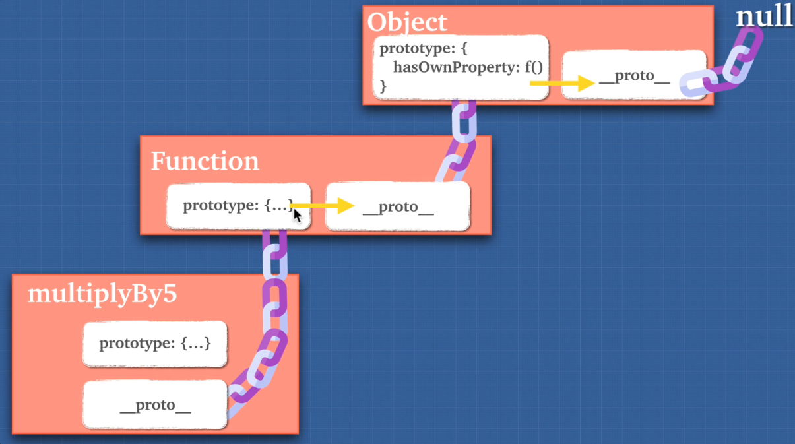

# Closures

- Closures are one of the most powerful features of JavaScript.
- JavaScript allows for the nesting of functions and grants the inner function full access to all the variables and functions defined inside the outer function (and all other variables and functions that the outer function has access to).
- However, the outer function does not have access to the variables and functions defined inside the inner function. This provides a sort of **encapsulation** for the variables of the inner function.
- Also, since the inner function has access to the scope of the outer function, the **variables and functions defined in the outer function will live longer than the duration of the outer function execution**, if the inner function manages to survive beyond the life of the outer function.
- **A closure is created when the inner function is somehow made available to any scope outside the outer function.**

`In JavaScript, a closure is a function that references variables in the outer scope from its inner scope. The closure preserves the outer scope inside its inner scope.`

To understand the closures, you need to know how the lexical scoping works first.

## Lexical scoping

- Lexical scoping defines the scope of a variable by the position of that variable declared in the source code.

```
let name = 'John';

function greeting() {
    let message = 'Hi';
    console.log(message + ' '+ name);
}
```

The variable **_name_** is a **global variable.** It is accessible from anywhere including within the **greeting()** function.

The variable **_message_** is a local variable that is accessible only within the greeting() function.

If you try to access the message variable outside the greeting() function, you will get an error.

So the JavaScript engine uses the scope to manage the variable accessibility.

`According to lexical scoping, the scopes can be nested and the inner function can access the variables declared in its outer scope.`

#### **EXAMPLES**

```
function greeting() {
    let message = 'Hi';

    function sayHi() {
        console.log(message);
    }

    return sayHi;
}
let hi = greeting();
hi(); // still can access the message variable
```

`Note that functions are the first-class citizens in JavaScript, therefore, you can return a function from another function.`

- However, the interesting point here is that, normally, a local variable only exists during the execution of the function.
- In this case, we execute the hi() function that references the sayHi() function, the message variable still exists.
- The magic of this is closure. In other words, the sayHi() function is a closure.

`A closure is a function that preserves the outer scope in its inner scope`

```
var pet = function(name) {   // The outer function defines a variable called "name"
  var getName = function() {
    return name;             // The inner function has access to the "name" variable of the outer
                             //function
  }
  return getName;            // Return the inner function, thereby exposing it to outer scopes
}
myPet = pet('Vivie');

myPet();
```

- It can be much more complex than the code above. An object containing methods for manipulating the inner variables of the outer function can be returned.

```
var createPet = function(name) {
  var sex;

  return {
    setName: function(newName) {
      name = newName;
    },

    getName: function() {
      return name;
    },

    getSex: function() {
      return sex;
    },

    setSex: function(newSex) {
      if(typeof newSex === 'string' && (newSex.toLowerCase() === 'male' ||
        newSex.toLowerCase() === 'female')) {
        sex = newSex;
      }
    }
  }
}

var pet = createPet('Vivie');
pet.getName();                  // Vivie
pet.getSex()                    // undefined
pet.setName('Oliver');
pet.setSex('male');
pet.getSex();                   // male
pet.getName();                  // Oliver
```

> > **JavaScript closures in a loop**

```
for (var index = 1; index <= 3; index++) {
    setTimeout(function () {
        console.log('after ' + index + ' second(s):' + index);
    }, index * 1000);
}
```

OUTPUT

## CLOSURES AND PROTOTYPES

- Closures and Prototypal Inheritance are two things that make JavaScript special and different from other programming languages.

### Function Constructor

- Functions are objects in JavaScript, which is not true for other languages. Because of that, they can be called multiple ways, but they can also be constructors. A function constructor creates a new object and returns it. Every JavaScript function, is actually a function object itself.

```
(function() {}.contructor === Function);
// true

// function constructor
new Function("optionalArguments", "functionBody");

const four = new Function("return four"); // 4
const sum = new Function("x", "y", "return x + y");
console.log(sum(2, 3)); // 5
```

- Almost everything in JavaScript can be created with a constructor. Even basic JavaScript types like numbers and strings can be created using a constructor.

```
// examples of constructor functions in JavaScript
const five = new Number(5);
const assignFive = 5;

// this is different than using regular assignment
const newString = new String(`I am a new string`);
const assignString = `I am an assigned string`;

typeof five; // object
typeof assignFive; // number
typeof newString; //object
typeof assignString; // string

five === assignFive; // false
five == assignFive; // true - types are coerced

// Notice how the types are different
// depending on how they are created.

// Arrays, Booleans, Dates, Objects, and Strings
// can be created this way as well.
```

### Prototypal Inheritance

- Almost all objects in Javascript pass down properties through a prototype chain. We call this chain, prototypal inheritance. The child of the object "inherits" properties from its parent. All objects in JavaScript are descended from the Object constructor unless deliberately created or altered to not do so. The objects inherit methods and properties from Object.prototype. The prototype property also has an accessor property called **proto** that creates a link between the current object and points to the object it was created from, the "prototype".

```
Object.prototype.__proto__;
// null

Object.prototype;
{
  __proto__: null;
  // ...more methods and properties
}

Object;
// function Object()
// This is the object constructor function

Object.prototype.constructor;
// function Object()
// Points to the constructor

Object.__proto__;
// function () {...}
// Because it is created with a constructor function
```

### Prototype vs \_\_proto\_\_

- Understanding the difference between **proto** and prototype can be quite a confusing concept for JavaScript developers. Every function in JavaScript automatically gets a prototype property when it is created that gives it the call, apply, and bind methods. It doesn't really do anything with regular functions, but in constructor functions the prototype property allows us to add our own methods to the objects we create. The **proto** property is what creates the link between prototype objects, the child inherits properties from the parent through the prototype chain. Each time a new object is created in JavaScript, it uses the **proto** getter function to use a built in constructor function based on what is being created. This could be an Array, Boolean, Date, Number, Object, String, Function, or RegExp. Each one has their own separate properties and methods that they inherit from the constructor.
  

```
let newArr = new Array
newArr
/* []
    {
// all array properties and methods
// inherited from Array constructor function.
      length: 0
      prototype: {
        concat, forEach, pop, splice...
        __proto__: Array(0)
        prototype: {
          __proto__: Object
          prototype: {
            __proto__: null
          }
        }
      }
    }
```

- Closures allow a function to access variables from an enclosing scope or environment even after it leaves the scope in which it was declared. In other words, a closure gives you access to its outer functions scope from the inner scope. The JavaScript engine will keep variables around inside functions that have a reference to them, instead of "sweeping" them away after they are popped off the call stack.

```
function a() {
  let grandpa = 'grandpa'
  return function b() {
    let father = 'father'
    let random = 12345 // not referenced, will get garbage collected
    return function c() {
      let son = 'son'
      return `closure inherited all the scopes: ${grandpa} > ${father} > ${son}`
    }
  }
}

a()()()

// closure inherited all the scopes: grandpa > father > son

const closure = grandma => mother => daughter => return `${grandma} > ${mother} > ${daughter}`

// grandma > mother > daughter
```

> A Fun Example with Closures:

```
function callMeMaybe() {
   const callMe = `Hey, I just met you!`
   setTimeout(function() {
       console.log(callMe)
   }, 8640000000);

callMeMaybe()

// ONE DAY LATER
// Hey, I just met you!
```

- Do not run this in the console, it takes 1 day to timeout!
- Two of the major reasons closures are so beneficial are memory efficiency and encapsulation.

### Memory Efficient

- Using closures makes your code more memory efficient. Take the example below.

```
function inefficient(idx) {
  const bigArray = new Array(7000).fill("😄");
  console.log("created!");
  return bigArray[idx];
}

function efficient() {
  const bigArray = new Array(7000).fill("😄");
  console.log("created again!");
  return function(idx) {
    return bigArray[idx];
  };
}

inefficient(688);
inefficient(1000);
inefficient(6500);

const getEfficient = efficient();

efficient(688);
efficient(1000);
efficient(6500);

// created!
// created!
// created!
// created Again!
// '😄'

// inefficient created the bigArray 3 times
// efficient created the bigArray only once
```

### Encapsulation

- Encapsulation means the restriction of direct access to some of an object's components. It hides as much as possible of an object's internal parts and only exposes the necessary parts to run. Why use encapsulation?
  - Security - Controlled access
  - Hide Implementation and Expose Behaviours
  - Loose Coupling - Modify the implementation at any time

```
const encapsulation = () => {
  let people = [];
  const setName = name => people.push(name);
  const getName = idx => people[idx];
  const rmName = idx => people.splice(idx, 1);
  return {
    setName,
    getName,
    rmName
  };
};
const data = encapsulation();
data.setName("Brittney"); // 0
data.getName(0); // 'Brittney'
data.rmName(0); // ['Brittney']
// you have no access to the array people
// can only change it via methods provided
```
