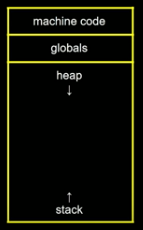
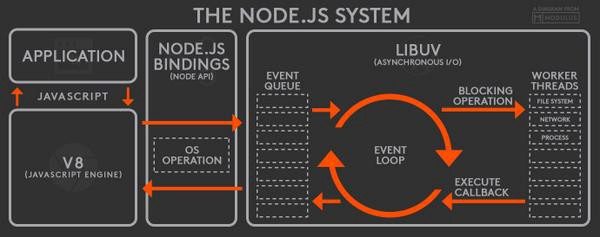
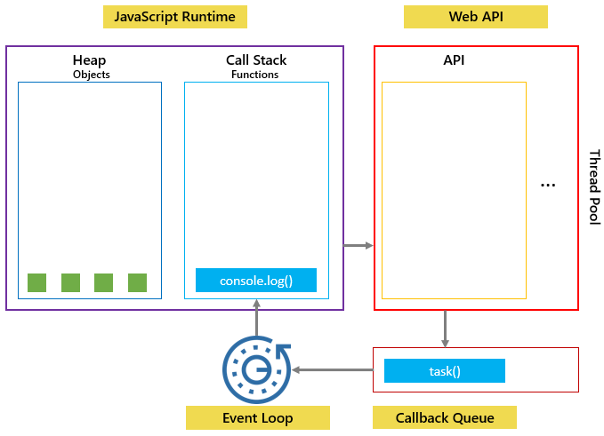

# CALL STACK AND MEMORY HEAP

- The JavaScript engine does a lot of work for us, but 2 of the biggest jobs are reading and executing it.
- We need a place to store and write our data and a place to keep track line by line of what's executing. That's where the call stack and the memory heap come in.

## Memory Heap

- The memory heap is a place to store and write information so that we can use our memory appropriately. It is a place to allocate, use, and remove memory as needed. Think of it as a storage room of boxes that are unordered.

```
// tell the memory heap to allocate memory for a number
const number = 11;
// allocate memory for a string
const string = "some text";
// allocate memory for an object and it's values
const person = {
  first: "Brittney",
  last: "Postma"
};
```



## Call Stack

- The call stack keeps track of where we are in the code, so we can run the program in order.

```
function subtractTwo(num) {
  return num - 2;
}

function calculate() {
  const sumTotal = 4 + 5;
  return subtractTwo(sumTotal);
}
debugger;
calculate();
```

- Things are placed into the call stack on top and removed as they are finished. It runs in a first in last out mode.
- Each call stack can point to a location inside the memory heap.
- In the above snippet the call stack looks like this.

```
anonymous; // file is being ran
// CALL STACK

// hits debugger and stops the file
// step through each line

calculate(
  // steps through calculate() sumTotal = 9
  anonymous
);
// CALL STACK

// steps into subtractTwo(sumTotal) num = 9

subtractTwo; // returns 9 - 2
calculate(anonymous);
// CALL STACK

// subtractTwo() has finished and has been removed

calculate(
  // returns 7
  anonymous
)(
  // CALL STACK

  // calculate() has finished and has been removed

  anonymous
);
// CALL STACK

// and finally the file is finished and is removed

// CALL STACK
```

## STACK OVERFLOW

- So what happens if you keep calling functions that are nested inside each other? When this happens it's called a stack overflow.

```
// When a function calls itself,
// it is called RECURSION
function inception() {
  inception();
}

inception();
// returns Uncaught RangeError:
// Maximum call stack size exceeded
```

## Synchronous

- So, what is the issue with being a single threaded language? Lets's start from the beginning.
- When you visit a web page, you run a browser to do so (Chrome, Firefox, Safari, Edge). Each browser has its own version of JavaScript Runtime with a set of Web API's, methods that developers can access from the window object.
- In a synchronous language, only one thing can be done at a time. Imagine an alert on the page, blocking the user from accessing any part of the page until the OK button is clicked. If everything in JavaScript that took a significant amount of time, blocked the browser, then we would have a pretty bad user experience. This is where concurrency and the event loop come in.

## Event Loop and Callback Queue

- When you run some JavaScript code in a browser, the engine starts to parse the code.
- Each line is executed and popped on and off the call stack. But, what about Web API's? Web API's are not something JavaScript recognizes, so the parser knows to pass it off to the browser for it to handle.
- When the browser has finished running its method, it puts what is needed to be ran by JavaScript into the callback queue.
- The callback queue cannot be ran until the call stack is completely empty. So, the event loop is constantly checking the call stack to see if it is empty so that it can add anything in the callback queue back into the call stack. And finally, once it is back in the call stack, it is ran and then popped off the stack.

```
console.log("1");
// goes on call stack and runs 1
setTimeout(() => {
  console.log("2"), 1000;
});
// gets sent to web api
// web api waits 1 sec, runs and sends to callback queue
// the javascript engine keeps going
console.log("3");
// goes on call stack and runs 3
// event loop keeps checking and see call stack is empty
// event loop sends calback queue into call stack
// 2 is now ran

// 1
// 3
// 2

// Example with 0 second timeout

console.log("1");
setTimeout(() => {
  console.log("2"), 0;
});
console.log("3");

// 1
// 3
// 2

// Still has the same output
```

- In the last example, we get the same output. How does this work if it waits 0 seconds? The JavaScript engine will still send off the setTimeout() to the Web API to be ran and it will then go into the callback queue and wait until the call stack is empty to be ran. So, we end up with the exact same end point.

`Nifty Snippet: Until 2009, JavaScript was only run inside of the browser. That is when Ryan Dahl decided it would be great if we could use JavaScript to build things outside the browser. He used C and C++ to build an executable (exe) program called Node JS. Node JS is a JavaScript runtime environment built on Chrome's V8 engine that uses C++ to provide the event loop and callback queue needed to run asynchronous operations.`


`The very same Ryan Dahl then gave a talk back in 2018, 10 Things I Regret About Node.js which led to the recent release of his new (and improved) JavaScript and TypeScript called Deno which aims to provide a productive and secure scripting environment for the modern programmer. It is built on top of V8, Rust, and TypeScript.`

## Job Queue

- The job queue or microtask queue came about with promises in ES6. With promises we needed another callback queue that would give higher priority to promise calls. The JavaScript engine is going to check the job queue before the callback queue.

```
// 1 Callback Queue ~ Task Queue
setTimeout(() => {
  console.log("1", "is the loneliest number");
}, 0);
setTimeout(() => {
  console.log("2", "can be as bad as one");
}, 10);

// 2 Job Queue ~ Microtask Queue
Promise.resolve("hi").then(data => console.log("2", data));

// 3
console.log("3", "is a crowd");

// 3 is a crowd
// 2 hi
// undefined Promise resolved
// 1 is the loneliest number
// 2 can be as bad as one
```

## JavaScript single-threaded model

- JavaScript is a single-threaded programming language. In other words, JavaScript can do only one thing at a single point in time.
- The JavaScript engine executes a script from the top of the file and works its way down. JavaScript creates the execution contexts and pushes and pops functions onto and off the call stack in the execution process.
- If a function takes a long time to execute, you cannot interact with the web browser during the function’s execution because the page hangs.
- A function that takes a long time to complete is called a blocking function. Technically, a blocking function blocks all the interactions of the webpage, such as mouse click.

> > **EXAMPLE 1**

```
function task(message) {
    // emulate time consuming task
    let n = 10000000000;
    while (n > 0){
        n--;
    }
    console.log(message);
}

console.log('Start script...');
task('Download a file.');
console.log('Done!');
```


### Callbacks to the rescue

- To prevent a blocking function from blocking other activities, you typically put it in a callback function for execution later.

```
console.log('Start script...');

setTimeout(() => {
    task('Download a file.');
}, 1000);

console.log('Done!');
```

In this example, you’ll see the message 'Start script...' and 'Done!' immediately. And after that, you’ll see the message 'Download a file'.

- As mentioned earlier that JavaScript can do only one thing at a time. However, it’s more precise to say that the JavaScript runtime can do one thing at a time.

- The web browser also has other components, not just the JavaScript engine.

- When you call the setTimeout() function, make a fetch request or click a button, the web browser can do these activities concurrently and asynchronously.
- The setTimeout(), fetch requests, and DOM events are parts of the Web APIs of the web browser.
- In our example, when you call the setTimeout() function, the JavaScript engine places it on the call stack, and the Web API creates a timer that expires in 1 second.
  

- Then JavaScript engine place the task() function is into a queue called a callback queue or a task queue:
  
- The event loop is a constantly running process that monitors both the callback queue and the call stack.
- If the call stack is not empty, the event loop waits until it is empty and places the next function from the callback queue to the call stack. If the callback queue is empty, nothing will happen:

> > **EXAMPLE 2**

```
console.log('Hi!');

setTimeout(() => {
    console.log('Execute immediately.');
}, 0);

console.log('Bye!');
```

- In this example, the timeout is 0 second, so the message 'Execute immediately.' should appear before the message 'Bye!'. However, it is not the case. However, it doesn’t work like that.
- The JavaScript engine places the following function call on the callback queue and executes it when the call stack is empty. In other words, the JavaScript engine executes it after the console.log('Bye!').

##### **OUTPUT**

```
Hi!
Bye!
Execute immediately.
```


