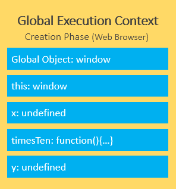

# EXECUTION CONTEXT

- Code in JavaScript is always run inside a type of execution context. - Execution context is simply the environment within which your code is ran.
- There are 2 types of execution context in JavaScript, global or function.
- There are 2 stages as well to each context, the creation and executing phase.
- As the JavaScript engine starts to read your code, it creates something called the Global Execution Context.

```js
let x = 10;

function timesTen(a) {
  return a * 10;
}

let y = timesTen(x);

console.log(y); // 100
```

## Global Execution Context

#### **Creation Phase**

- When a script executes for the first time, the JavaScript engine creates a Global Execution Context. During this creation phase, it performs the following tasks:

  1. **Create a global object** i.e., window in the web browser or global in Node.js.
  2. Create a **_this_** object binding which **points to the global object** above.

  3. Setup a **memory heap** for storing **variables and function references.**

  4. Store the **function declarations in the memory heap** and variables within the global execution context with the initial values as **undefined.**

`During the creation phase, the JavaScript engine moves the variable and function declarations to the top of your code. This feature is known as hoisting in JavaScript.`

In our example, during the creation phase, the JavaScript engine stores the variables x and y and the function declaration timesTen() in the Global Execution Context. Besides, it initializes the variables x and y to undefined.



After the creation phase, the global execution context moves to the execution phase.

#### **Executing Phase**

- During the execution phase, the JavaScript engine executes the code line by line. In this phase, it assigns values to variables and executes the function calls.


- For every function call, the JavaScript engine creates a new **Function Execution Context.**
- Function Execution Context is similar to the Global Execution Context, but **instead of creating the global object, it creates the arguments object** that contains a reference to all the parameters passed into the function:


- In our example, the function execution context creates the arguments object that references all parameters passed into the function, sets this value to the global object, and initializes the a parameter to undefined.

- During the execution phase of the function execution context, it assigns 10 to the parameter a and returns the result (100) to the Global Execution Context:


`To keep track of all the execution contexts, including the Global Execution Context and Function Execution Contexts, the JavaScript engine uses a data structure named "call stack",`

```js
this;
window;
this === window;

// Window {...}
// Window {...}
// true
```

## Function Execution Context

- Only when a function is invoked, does a function execution context get created.

#### **Creation Phase**

1. argument object created with any arguments
2. initializes this keyword to point called or to the global object **_if not specified_**.
3. Variable Environment created - memory space for variable and functions created
4. initializes all variables to undefined and places them into memory with any new functions

#### **Executing Phase**

- In this phase, it assigns values to variables and executes the function calls.

```js
// Function Execution Context creates arguments object and points 'this' to the function
function showArgs(arg1, arg2) {
  console.log("arguments: ", arguments);
  return `argument 1 is: ${arg1} and argument 2 is: ${arg2}`;
}

showArgs("hello", "world");

// arguments: { 0: 'hello', 1: 'world' }
// argument 1 is hello and argument 2 is world

function noArgs() {
  console.log("arguments: ", arguments);
}

noArgs();

// arguments: {} // even though there are no arguments, the object is still created
```

`The keyword arguments can be dangerous to use in your code as is. In ES6, a few methods were introduced that can help better use "arguments".`

```js
function showArgs(arg1, arg2) {
  console.log("arguments: ", arguments); // Arguments(2) ["hello", "world", callee: ƒ, Symbol(Symbol.iterator): ƒ]
  console.log(Array.from(arguments)); //(2) ["hello", "world"]
}

showArgs("hello", "world");

// using "rest parameter"
function showArgs2(...args) {
  console.log("arguments: ", args); // arguments:  (2) ["hello", "world"]
  console.log(Array.from(arguments)); // ["hello", "world"]
  return `${args[0]} ${args[1]}`;
}

console.log(showArgs2("hello", "world")); // hello world
```

## LEXICAL ENVIRONMENT

- A lexical environment is basically the _scope or environment_ the engine is currently reading code in. **A new lexical environment is created when curly brackets {}** are used, even nested brackets {{...}} create a new lexical environment.
- The **execution context tells the engine which lexical environment it is currently working in** and the lexical scope determines the available variables.

```js
function one() {
  var isValid = true;
  console.log(isValid); // true  // local env
  two(); // new execution context
}

function two() {
  var isValid;
  console.log(isValid); // undefined
}

var isValid = false;
console.log(isValid); // false // global
one();

/*
   two() isValid = undefined
   one() isValid = true
   global() isValid = false
   ------------------------
   call stack
*/
```

## SCOPE CHAIN

- **Each environment context that is created has a link outside of its lexical environment called the scope chain**. The scope chain gives us access to variables in the **parent environment.**
  

```js
var x = "x";

function findName() {
  console.log(x); // "x"
  var b = "b";
  return printName();
}

function printName() {
  var c = "c";
  return "Brittney Postma";
}

function sayMyName() {
  var a = "a";
  return findName();
}

sayMyName();

// sayMyName runs a = 'a'
// findName runs
// x
// b = 'b'
// printName runs c = 'c'
// Brittney Postma
```

- In this example, all the functions have access to the **global variable x**, but trying to access a variable from another function would return an error. The example below will show how the scope chain links each function.

```js
function sayMyName() {
  var a = "a";
  console.log(b, c); // returns error
  return function findName() {
    var b = "b";
    console.log(a); // a
    console.log(c); // returns error
    return function printName() {
      var c = "c";
      console.log(a, b); // a, b
    };
  };
}

sayMyName()()(); //each function is returned and has to be called
```

- In this example, you can see that the **functions only get access to the variables in their parent container, not a child.** **_The scope chain only links down the call stack_**, so you almost have to think of it in reverse. It goes up to the parent, but down the call stack.
  

### JavaScript is Weird

```js
// It asks global scope for height.
// Global scope says: ummm... no but here I just created it for you.
// We call this leakage of global variables.
// Adding 'use strict' to the file prevents this and causes an error.
function weird() {
  height = 50;
}

var heyhey = function doodle() {
  // code here
};

heyhey();
doodle(); // Error! because it is enclosed in its own scope.
```
