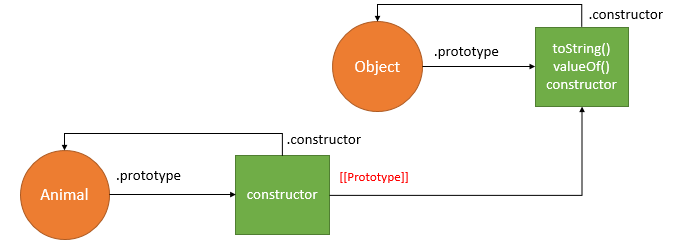
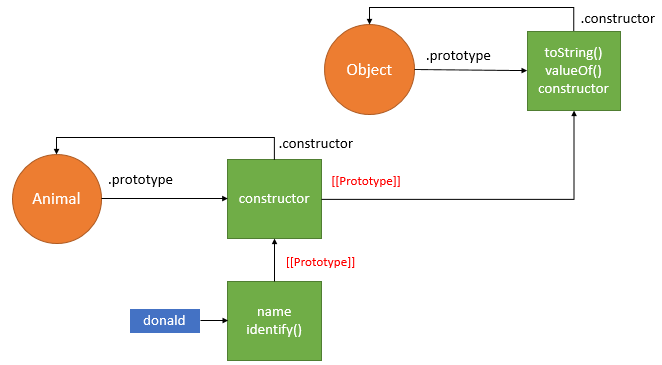
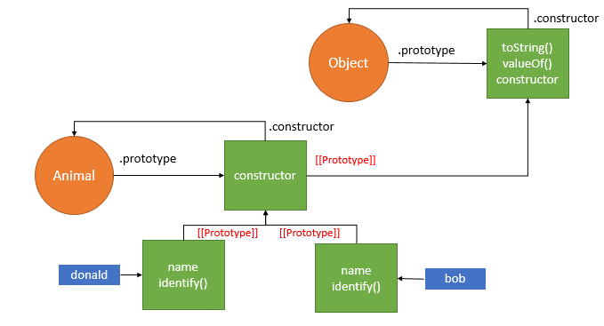

# Constructors and object instances

- JavaScript uses special functions called constructor functions to define and initialize objects and their features.
- They are useful because you'll often come across situations in which you don't know how many objects you will be creating;
- constructors provide the means to create as many objects as you need in an effective way, attaching data and functions to them as required.
- Let's start by looking at how you could define a person with a normal function

```
function createNewPerson(name) {
  const obj = {};
  obj.name = name;
  obj.greeting = function() {
    alert('Hi! I\'m ' + obj.name + '.');
  };
  return obj;
}
```

- ou can now create a new person by calling this function

```
const salva = createNewPerson('Salva');
salva.name;
salva.greeting();
```

- This works well enough, but it is a bit long-winded; if we know we want to create an object, why do we need to explicitly create a new empty object and return it?
- Fortunately, JavaScript provides us with a handy shortcut, in the form of **_constructor functions_**

- Replace your previous function with the following

```
function Person(name) {
  this.name = name;
  this.greeting = function() {
    alert('Hi! I\'m ' + this.name + '.');
  };
}
```

- The constructor function is JavaScript's version of a class.
- it has all the features you'd expect in a function, although it doesn't return anything or explicitly create an object — it basically just defines properties and methods.
- Notice also the this keyword being used here as well — it is basically saying that whenever one of these object instances is created, the object's name property will be equal to the name value passed to the constructor call, and the greeting() method will use the name value passed to the constructor call too.

```
Note: A constructor function name usually starts with a capital letter — this convention is used to make constructor functions easier to recognize in code.
```

- call a constructor to create some objects

```
let person1 = new Person('Bob');
let person2 = new Person('Sarah');
```

- A JavaScript constructor method is a special type of method which is used to initialize and create an object.
- It is called when memory is allocated for an object.

- Points to remember:

  1. The constructor keyword is used to declare a constructor method.

  2. The class can contain one constructor method only.
  3. JavaScript allows us to use parent class constructor through super keyword.

Note - If we didn't specify any constructor method, JavaScript use default constructor method.

- It is basically just a function (this is also is ES5): can make as many object through construtor
- to differntiate "constructor" from the " function" we use UPPERCASE in constrctor
- Only difference between both is that we call constructor function with "new" operator
- We can use both function declaration and function expression to define constructor function.
- But array function will not work as fujction constructor(bcoz it doesnot have its own this keyword)

# new operator

- It is a very special operator .It does 4 things behind the scene
  1. new empty object is created.
  2. function is called.And in this.."this" is equal to the newly created object // this = {}
  3. newly created object is linked to the prototype // this will create **proto** property on objects and sets the value equal to prototype of constructor function
  4. function automaticaaly returns the object after adding properties

## METHOD 3: Factory pattern to create object

- The factory pattern uses a function to abstract away the process of creating specific objects.

> **For example, the following createAnimal() function encapsulates the logic of creating the animal object.**

```
// factory pattern
function createAnimal(name) {
    var o = new Object();
    o.name = name;
    o.identify = function() {
        console.log("I'm " + o.name);
    }
    return o;
}
```

> To create a new object, you just need to call this function and pass the name argument as follows:

```
var tom = createAnimal('Tom');
var jerry = createAnimal('Jerry');

tom.identify(); // I'm Tom
jerry.identify(); // I'm Jerry
```

`Although the factory pattern can create multiple similar objects, it doesn’t allow you to identify the type of object it creates.`

## METHOD 4: Constructor pattern to create object

- JavaScript allows you to create a custom constructor function that defines the properties and methods of user-defined objects.

```
function Animal(name) {
    this.name = name;
    this.identify = function() {
        console.log("I'm " + this.name);
    };
}
```

- Unlike the factory pattern, the properties and methods of the animal object are assigned directly to the this object inside the constructor function.
- At this point, JavaScript engine creates the **Animal() function** and an **anonymous object.**
- The **Animal() function** has the **prototype property reference an anonymous object** and the **anonymous object has the constructor property reference the Animal() function.**
- In addition, the JavaScript engine **links the anonymous object to the Object.**
  
- To create a new instance of Animal, you use the new operator.

```
var donald = new Animal('Donald');
```

- Behind the scenes, JavaScript executes these four steps:

  1. Create a new object.
  2. Set the this value of the constructor to the new object.
  3. Execute code inside the constructor i.e., adding properties to the new object.
  4. Return the new object.

  

```
console.log(donald.constructor === Animal); // true
```

- In this example, because the **donald object** does not have the **constructor property,** JavaScript engine follows the prototype chain to find it in the **Animal.prototype object.**
- It found the **constructor property** in the **Animal.prototype object** and in this case the constructor property points to the **Animal() function**, therefore the statement above returns **true**.
- The donald object is also an instance of Animal and Object as follows:

```
console.log(donald instanceof Animal); // true
console.log(donald instanceof Object); // true
```

`The disadvantage of the constructor pattern is that the same method identify() is duplicated in each instance.`

```
var bob = new Animal('Bob');
```



`As you see, the identify() method is duplicated in both donald and bob objects. To solve this issue, you use the prototype pattern.`
