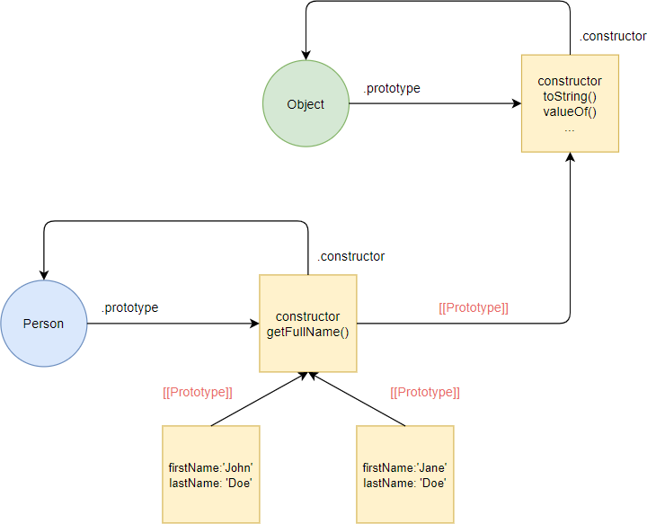

# JavaScript Constructor Prototype

- The **combination of the constructor and prototype patterns** is the most common way to define custom types in **ES5.**
- The **constructor pattern defines object properties** while the **prototype pattern defines methods** and shared properties of the objects.
- By using this pattern, all objects of a custom type share the methods defined in the prototype. And each object has its own properties.
- This **constructor/prototype** takes the best parts of both constructor and prototype patterns.

## JavaScript Constructor / Prototype example

- Suppose that you want to define a custom type called Person that has:
  - Two properties firstName and lastName
  - One method getFullName()

> > First, you use the constructor function to initialize the properties:

```js
function Person(firstName, lastName) {
  this.firstName = firstName;
  this.lastName = lastName;
}
```

- Behind the scene, JavaScript defines a Person function denoted by the circle and an anonymous object denoted by the square.
- The Person function has the prototype property that references an anonymous object. The anonymous object has a constructor property that references the Person function.
  > > Second, you define the getFullName() method in the prototype object of the Person function:

```js
Person.prototype.getFullName = function () {
  return this.firstName + " " + this.lastName;
};
```

> > Third, you can create multiple instances of the Person type:

```js
let p1 = new Person("John", "Doe");
console.log(p1.getFullName());

let p2 = new Person("Jane", "Doe");
console.log(p2.getFullName());
```

#### Output

```
'John Doe'
'Jane Doe'
```

- Javascript creates two objects p1 and p2. These objects link to the Person.prototype object via the [[Prototype]] linkage:



- Each object has its own properties firstName and lastName. However, they share the same getFullName() method.

## Classes in ES6

- ES6 introduces the class keyword that makes the constructor/prototype pattern **easier to use**

> > The following uses the **_class keyword_** to define exactly same Person type:

```js
class Person {
  constructor(firstName, lastName) {
    this.firstName = firstName;
    this.lastName = lastName;
  }
  getFullName() {
    return this.firstName + " " + this.lastName;
  }
}
```

- In this syntax, the class moves the property initialization to the constructor method. It also packs the getFullName() method in the same place as the constructor function.

`The class syntax looks cleaner and less verbose. However, it’s just syntactic sugar over the constructor/prototype pattern.`
