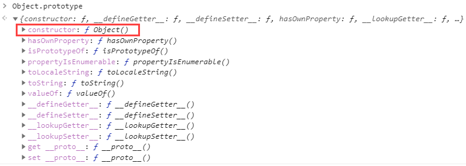
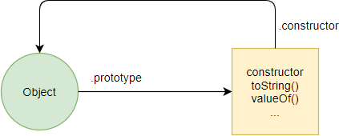
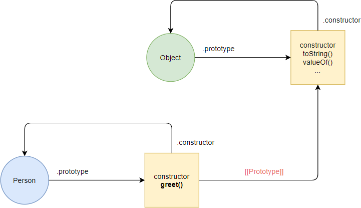
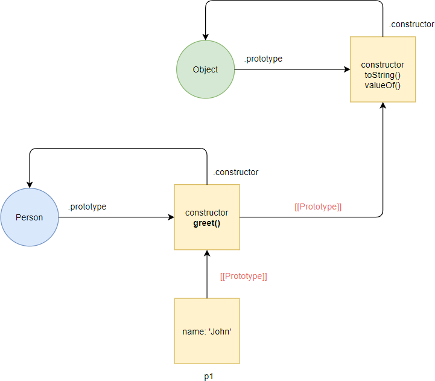
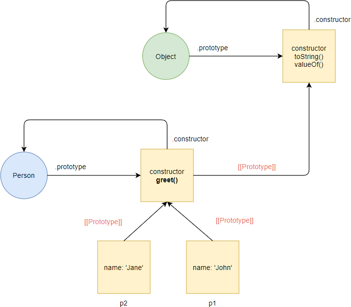
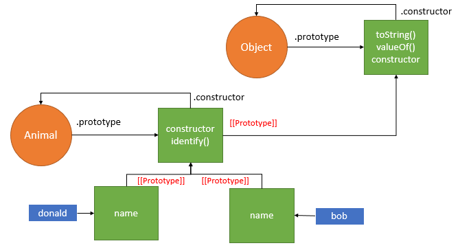

# Object prototypes

- Prototypes are the mechanism by which JavaScript objects inherit features from one another

## Introduction to JavaScript prototype

- By default, _the JavaScript provides the Object() function:_

```js
console.log(Object);
```

#### Output:

```
ƒ Object() { [native code] }
```

`Please note that the Object() is a function, not an object. `

`It also provides an anonymous object that can be referenced via the "prototype property" of the Object function:`

```js
console.log(Object.prototype);
```



- The **Object.prototype** object has many methods and properties such as toString() and valueOf().

`The Object.prototype also has an important property called constructor that references the Object() function.`

> > The following statement confirms that the **Object.prototype.constructor property references the Object function**:

```js
console.log(Object.prototype.constructor === Object); // true
```

### **Suppose that a circle represents a function and a square represents an object.**



> > First, define a constructor function called Person as follows:

```js
function Person(name) {
  this.name = name;
}
```

- Behind the scenes, JavaScript creates a new function Person() and an anonymous object:

  

- Like the Object() function, the Person() function has a property called prototype that references an anonymous object. And the anonymous object has the constructor property that references the Person() function.

> > The following shows the Person() function and the anonymous object referenced by the Person.prototype:

```js
console.log(Person);
console.log(Person.prototype);
```

- In addition, JavaScript links the Person.prototype object to the Object.prototype object via **[[Prototype]],** which is known as a **prototype linkage.**

> > The prototype linkage is denoted by [[Prototype]] in the following figure:


## Defining methods in the JavaScript prototype object

> > The following defines a new method called greet() in the Person.prototype object:

```js
Person.prototype.greet = function () {
  return "Hi, I'm " + this.name + "!";
};
```

- In this case, JavaScript adds the greet() method to the Person.prototype object:
  

> > The following creates a new instance of the Person :

```js
let p1 = new Person("John");
```

- Internally, the JavaScript engine creates a new object named p1 and links the p1 object to the Person.prototype object via the prototype linkage:
  

`The link of p1, Person.prototype, and Object.protoype is called the prototype chain.`

> > The following calls the toString() method on the p1 object:

```js
let s = p1.toString();
console.log(s);
```

- In this case, JavaScript follows the prototype chain to look up for the toString() method in the Person.prototype.

- Because the Person.prototype doesn’t have the toString() method, JavaScript follows the prototype chain and searches for the toString() method in the Object.prototype object.

- Since JavaScript can find the toString() method in the Object.prototype, it executes the toString() method.

  

- If you call a method that doesn’t exist on the Person.prototype and Object.prototype object, JavaScript will follow the prototype chain and throw an error if it cannot find the method.

> > The following creates another instance of the Person whose name property is 'Jane':

```js
let p2 = new Person("Jane");
```



- The p2 object has the properties and methods as the p1 object.

`In conclusion, when you define a method on the prototype object, this method is shared by all instances.`

## Defining methods in an individual object

`When you define a method in an object, the method only available to that object. It cannot be shared with other objects by default.`

## Getting prototype linkage

- The \_\_proto\_\_ is pronounced as dunder proto. The \_\_proto\_\_ is an accessor property of the Object.prototype object.
- It exposes the internal prototype linkage ( [[Prototype]]) of an object through which it is accessed.

`The __proto__ has been standardized in ES6 to ensure compatibility for web browsers. However, it may be deprecated in favor of Object.getPrototypeOf() in the future. Therefore, you should never use __proto__ in your production code.`

- The **p1.\_\_proto\_\_** exposes the **[[Prototype]]** that references the Person.prototype object.

- Similarly, **p2.\_\_proto\_\_** also references the same object as **p1.\_\_proto\_\_:**

```js
console.log(p1.__proto__ === Person.prototype); // true
console.log(p1.__proto__ === p2.__proto__); // true
```

- As mentioned earlier, you should use the **Object.getPrototypeOf()** method instead of the **\_\_proto\_\_.**

`The Object.getPrototypeOf() method returns the prototype of a specified object.`

```js
console.log(p1.__proto__ === Object.getPrototypeOf(p1)); // true
```

- Another popular way to get the prototype linkage when the Object.getPrototypeOf() method wasn’t available is via the constructor property as follows:

```js
p1.constructor.prototype;
```

- The p1.constructor returns Person, therefore, p1.constructor.prototype returns the prototype object.

## Shadowing

- See the following method call:

```js
console.log(p1.greet());
```

- The p1 object doesn’t have the greet() method defined, therefore JavaScript goes up to the prototype chain to find it. In this case, it can find the method in the Person.prototype object.

- Let’s add a new method to the object p1 with the same name as the method in the Person.prototype object:

```js
p1.greet = function () {
  console.log("Hello");
};
```

```js
console.log(p1.greet());
```

- Because the p1 object has the greet() method, JavaScript just executes it immediately without looking it up in the prototype chain.
- This is an example of shadowing. The greet() method of the p1 object shadows the greet() method of the prototype object which the p1 object references.

## A prototype-based language?

- JavaScript is often described as a prototype-based language — to provide inheritance,
- objects can have a prototype object, which acts as a template object that it inherits methods and properties from.
- An object's prototype object may also have a prototype object, which it inherits methods and properties from, and so on.
- This is often referred to as a **_prototype chain,_** and explains why different objects have properties and methods defined on other objects available to them.
- In JavaScript, a link is made between the object instance and its prototype (its **proto** property, which is derived from the prototype property on the constructor), and the properties and methods are found by walking up the chain of prototypes.
- JavaScript is a prototype-based language that facilitates the objects to acquire properties and features from one another.
- Here, each object contains a prototype object.
- In JavaScript, whenever a function is created the prototype property is added to that function automatically.
- This property is a prototype object that holds a constructor property.

```js
ClassName.prototype.methodName;
```

## What is the requirement of a prototype object??

- Whenever an object is created in JavaScript, its corresponding functions are loaded into memory.
- So, a new copy of the function is created on each object creation.
- In a prototype-based approach, all the objects share the same function.
- This ignores the requirement of creating a new copy of function for each object.
- Thus, the functions are loaded once into the memory.

## Prototype Chaining:

- In JavaScript, each object contains a prototype object that acquires properties and methods from it.
- Again an object's prototype object may contain a prototype object that also acquires properties and methods, and so on.
- It can be seen as prototype chaining.

```
Constructor function --- .prototype----> Prototype
Constructor function <--- .constructor ---- Prototype
```

`Note: Person.prototype is NOT the prototype of "Person" rather it is a prototype of object created by Person.`

- \_\_proto\_\_ property always points to the object prototype.

- Person.prototype is object itselt. Remember, every object in JS has a prototype.So,
  Person.prototype must also have a prototype . And that prototype is "Object.prototype"

```js
Person.prototype.__proto__ === Object.prototype;
```

- Object.prototype is just an object, which means it has to be built using build in "Object Constructor" function.
  T- his is actually the function which is called behind the seneces when we create object using object literals. That means object literal is just a shortcut of writting "new"

```js
  Object.prototype.__proto__ = null (end of prototype chain)
```

#### **EXAMPLE**

```js
function Book(title, author, year) {
  this.title = title;
  this.author = author;
  this.year = year;
}

Book.prototype.getSummary = function () {
  return `${this.title} was written by ${this.author} in ${this.year}`;
};

Book.prototype.getAge = function () {
  const years = new Date().getFullYear() - this.year;
  return `${this.title} is ${years} years old`;
};
```

```js
const book1 = new Book("Book 1", "John Doe", 2013);
```

```js
console.log(book1.__proto__ === Book.prototype); // true
console.log(Book === book1.__proto__.constructor); //true
console.log(Book === Book.prototype.constructor); //true
console.log(Book.prototype.constructor); // OUTPUT: Book
```

```js
console.log(book1.getSummary());
console.log(book1.getAge());
```

## Other ways to create object instance

- By now we have seen 3 methods to create object:
  1. Using object literal
  2. Using the Object() constructor
  3. Using Constructor function
- Constructors can help you give your code order—you can create constructors in one place, then create instances as needed, and it is clear where they came from.
- However, some people prefer to create object instances without first creating constructors, especially if they are creating only a few instances of an object.
- JavaScript has a built-in method called create() that allows you to do that
- With it, you can create a new object, using an existing object as the prototype of the newly created object.

### **Object.create()**

```js
const book2 = Object.create(book1);
```

```js
console.log(book2); // Book {}
console.log(book2.__proto__); // Book { title: 'Book 1', author: 'John Doe', year: 2013 }
console.log(book2.__proto__.__proto__); // Book { getSummary: [λ], getAge: [λ] }
```

```js
console.log(book2.getSummary()); // Book 1 was written by John Doe in 2013
console.log(book2.getAge()); // Book 1 is 8 years old
```

- You'll see that book2 has been created based on book1 as its prototype —it has the same properties and method available to it.

#### **EXAMPLE**

```js
# We first create prototype

const BookProtos = {
  getSummary: function () {
    return `${this.title} was written by ${this.author} in ${this.year}`;
  }

   getAge: function () {
     const years = new Date().getFullYear() - this.year;
     return `${this.title} is ${years} years old `;
   },
};
```

```js
const book1 = Object.create(BookProtos);
```

```js
console.log(book1); // {}
console.log(book1.__proto__); //   { getSummary: [λ: getSummary], getAge: [λ: getAge] }
```

```js
book1.title = "book 1";
book1.author = "prabhash";
book1.year = "2013";
```

```js
console.log(book1); // { title: 'book 1', author: 'prabhash', year: '2013' }
console.log(book1.getSummary()); // book 1 was written by prabhash in 2013
```

- We can do same things in short too

```js
const book1 = Object.create(BookProtos, {
  title: { value: "book 1" },
  author: { value: "prabhash" },
  year: { value: "2013" },
});
```

- We can make above example better by makking inti() fuunction inside the prototype. It will look similar to constructor function, but its not

```js
const BookProtos = {
  getSummary: function () {
    return `${this.title} was written by ${this.author} in ${this.year}`;
  },

  getAge: function () {
    const years = new Date().getFullYear() - this.year;
    return `${this.title} is ${years} years old `;
  },

  init(title, author, year) {
    this.title = title;
    this.author = author;
    this.year = year;
  },
};

const book1 = Object.create(BookProtos); // creating connection
book1.init("book1", "Prabhash", "2021"); // accessing the prototype method to initialize

console.log(book1); //{ title: 'book1', author: 'Prabhash', year: '2021' }
```

## METHOD 5: Prototype pattern to create object

- The prototype pattern adds the properties of the object to the prototype object. Then, these properties are available and shared among all instances.

```
function Animal() {
    // properties are added to prototype
}

Animal.prototype.name = 'Noname';
Animal.prototype.identify = function() {
    console.log("I'm " + this.name);
}
```


```
var donald = new Animal();
donald.name = 'Donald'; // shadow the name property
donald.identify(); // I'm Donald
```


- JavaScript engine adds the name property to the donald object. As the result, both donald and Animal.prototype objects has the same name property.
- Inside the identify() method, the this object is set to the donald object, therefore this.name references to the name property of the donald object.
- Let’s remove the name property of the donald object.

```
delete donald.name;
```

- and call the identify() method again.

```
donald.identify(); //I'm Noname
```

- Now, JavaScript could not find the name property in the donald object, it follows the prototype chain and finds it in the Animal.prototype object. Hence, the this.name returns Noname.

## Method 6 : Constructor / Prototype pattern to create object

- The combination of the constructor and prototype patterns is the most common way to define custom types.
- The constructor pattern defines object properties, while the prototype pattern defines methods and shared properties.
- By using this pattern, all objects of the custom type share the method and each of them has its own properties. This constructor/prototype takes the best parts of both constructor and prototype patterns.

```js
function Animal(name) {
  this.name = name;
}

Animal.prototype.identify = function () {
  console.log("I'm " + this.name);
};

var donald = new Animal("Donald");
donald.identify(); // I'm Donald

var bob = new Animal("Bob");
bob.identify(); // I'm Bob
```


