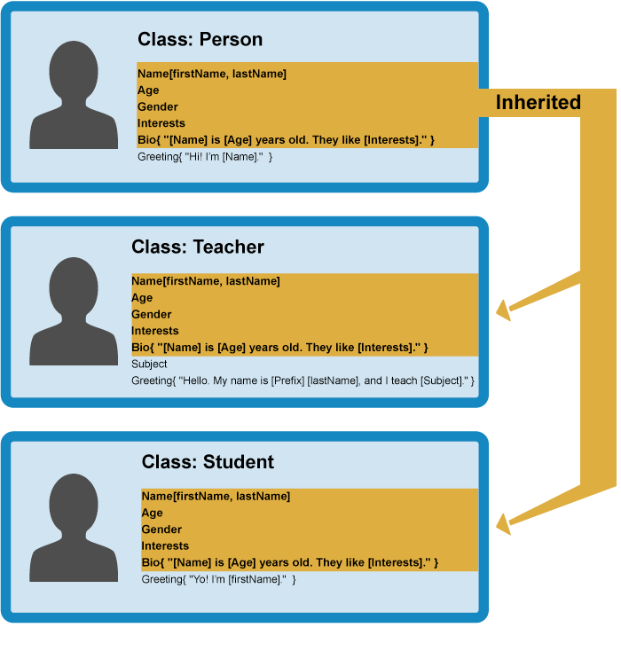

# Object-oriented JavaScript

## What is Object orianted programming?

- OOP is a programming paradigm(style of the code-how we write and organize the code) based on concept of objects

- we use objects to model(describe) real-world or abstract features.

- objects may contain data(properties) and code(methods) .By using objects, we pack "data and corresponding behavior" into one block.

- In OOP, objects are self-contained pieces/blocks of code.

- Objects are "building blocks" of our applications, and interect with one another.

- Interection happen through a "public interface"(API): Methods that the code "outside" of the object can access and use to communicate with the object.

- OOP was developed with the goal of organizing code, to make it more flexible and easier to maintain(avoid "spaghetti code")

- The basic idea of OOP is that we use objects to model real world things that we want to represent inside our programs, and/or provide a simple way to access functionality that would otherwise be hard or impossible to make use of.
- Object data (and often, functions too) can be stored neatly (the official word is encapsulated) inside an object package (which can be given a specific name to refer to, which is sometimes called a namespace), making it easy to structure and access; objects are also commonly used as data stores that can be easily sent across the network.

## Defining an object template

- Let's consider a simple program that displays information about the students and teachers at a school.
- To start this off, we could return to our Person object type from our first objects article, which defines the generic data and functionality of a person
- There are lots of things you could know about a person (their address, height, shoe size, DNA profile, passport number, significant personality traits ...) , but in this case we are only interested in showing their name, age, gender, and interests, and we also want to be able to write a short introduction about them based on this data, and get them to say hello.
- This is known as **_abstraction_** — creating a simple model of a more complex thing, which represents its most important aspects in a way that is easy to work with for our program's purposes.


## Creating actual objects

- From our class, we can create object instances — objects that contain the data and functionality defined in the class. From our Person class, we can now create some actual people:


- When an object instance is created from a class, the class's constructor function is run to create it.
- This process of creating an object instance from a class is called **_instantiation _** — the object instance is instantiated from the class.

## Specialist classes

- In this case we don't want generic people — we want teachers and students, which are both more specific types of people.
- In OOP, we can create new classes based on other classes — these new child classes (also known as subclasses) can be made to inherit the data and code features of their parent class, so you can reuse functionality common to all the object types rather than having to duplicate it.
- Where functionality differs between classes, you can define specialized features directly on them as needed.
  

```
Note: The fancy word for the ability of multiple object types to implement the same functionality is polymorphism.
```

- You can now create object instances from your child classes. For example:
  

## OBJECT ORIENTED PROGRAMMING VS FUNCTIONAL PROGRAMMING

- There are 2 basic philosophies when it comes to how you structure your programs, object oriented and functional. Each style has its use in programming, it is not one over the other, but merely a preference in style.

### **Object Oriented Programming**

- Object Oriented Programming, or OOP, is the idea that all code should be grouped into "boxes" (objects) to make your program easier to read and understand. Keeping the data encapsulated helps to keep the program organized. Each object has a state that defines what it does and methods (functions on an object) that can use or modify the state. Considering almost everything in JavaScript is an object, you would think this would be easy to do. Say we want to create a game that has lots of characters that all have different abilities. How would we go about this?

```js
const elf1 = {
  name: 'Dobby',
  type: 'house',
  weapon: 'cloth',
  say: function() {
    return `Hi, my name is ${this.name}, I am a ${this.type} elf.`
  }
  attack: function() {
    return `attack with ${this.weapon}`
  }
}

const elf2 = {
  name: 'Legolas',
  type: 'high',
  weapon: 'bow',
  say: function() {
    return `Hi, my name is ${this.name}, I am a ${this.type} elf.`
  }
  attack: function() {
    return `attack with ${this.weapon}`
  }
}

elf1.attack()
// attack with cloth
elf2.attack()
// attack with bow
```

#### **Factory Functions**

- As you can see, this code is already getting very repetitive and is not maintainable with only 1 character type. Imagine adding more characters, things would get out of control quickly. So, another way to create objects was introduced, factory functions. Factory functions return a new object every time they are ran. This could improve the code somewhat.

```js
function createElf(name, type, weapon) {
  return {
    name: name,
    type: type,
    weapon: weapon,
    say() {
      return `Hi, my name is ${name}, I am a ${type} elf.`;
    },
    attack() {
      return `${name} attacks with ${weapon}`;
    },
  };
}

const dobby = createElf("Dobby", "house", "cloth");
const legolas = createElf("Legolas", "high", "bow");

dobby.say(); // Hi, my name is Dobby, I am a house elf.
legolas.say(); // Hi, my name is Legolas, I am a high elf.
dobby.attack(); // Dobby attacks with cloth.
legolas.attack(); // Legolas attacks with bow.
```

#### **Stores**

- This is a step in the right direction, but if we added more characters, we would run into some of the same issues again. Not only is the code not DRY, the attack method is being created and taking up memory space for every new elf. This is not very efficient. How do we solve this? Well, we could separate the methods out into a store.

```js
const elfMethodsStore = {
  attack() {
    return `attack with ${this.weapon}`;
  },
  say() {
    return `Hi, my name is ${this.name}, I am a ${this.type} elf.`;
  },
};

function createElf(name, type, weapon) {
  return {
    name: name, // old way
    type, // with ES6 assignment, if they are the same name
    weapon,
  };
}

// each method has to be assigned to the store method to
// create the __proto__ chain
const dobby = createElf("Dobby", "house", "cloth");
dobby.attack = elfMethodsStore.attack;
dobby.say = elfMethodsStore.say;

const legolas = createElf("Legolas", "high", "bow");
legolas.attack = elfMethodsStore.attack;
legolas.say = elfMethodsStore.say;
```

#### **Object.create**

- Having a store saved us some efficiency in memory, but this was a lot of manual work to assign each method. So, we were given Object.create to help create this chain without having to assign each method.

```js
const elfMethodsStore = {
  attack() {
    return `attack with ${this.weapon}`;
  },
  say() {
    return `Hi, my name is ${this.name}, I am a ${this.type} elf.`;
  },
};

function createElf(name, type, weapon) {
  // this creates the __proto__ chain to the store
  let newElf = Object.create(elfMethodsStore);
  console.log(newElf.__proto__); // { attack: [Function], say: [Function] }
  // this assigns all the methods
  newElf.name = name;
  newElf.type = type;
  newElf.weapon = weapon;
  // this returns the new Elf with everything attached
  return newElf;
}

const dobby = createElf("Dobby", "house", "cloth");
const legolas = createElf("Legolas", "high", "bow");
dobby.attack; // attack with cloth
legolas.attack; // attack with bow
```

## Constructor Functions

- Using Object.create is true prototypal inheritance, the code is cleaner and easier to read. However, you will not see this being used in most programs. Before Object.create came around, we had the ability to use constructor functions. Constructor functions are exactly like the function constructor we talked about above. The number and string functions were constructed and invoked with the new keyword and they were capitalized. The new keyword actually changes the meaning of this for the constructor function. Without new, this will point to the window object instead of the object that we just created. It is best practice to capitalize constructor functions to help us identify them and know to use the new keyword. Properties added to a constructor function can only be done using the this keyword, regular variables do not get added to the object.

```js
// constructor functions are typically capitalized
function Elf(name, type, weapon) {
  // not returning anything
  // "constructing" a new elf
  this.name = name;
  this.type = type;
  this.weapon = weapon;
}

// to use a constructor function
// the "new" keyword must be used
const dobby = new Elf("Dobby", "house", "cloth");
const legolas = new Elf("Legolas", "high", "bow");

// To add methods we need to add
Elf.prototype.attack = function () {
  // cannot be an arrow function
  // this would be scoped to the window obj
  return `attack with ${this.weapon}`;
};
// This would need to be repeated for each method.

dobby.attack(); // attack with cloth
legolas.attack(); // attack with bow
```

> Nifty Snippet: A constructor function in JavaScript is actually just a constructor itself.

```js
// What happens under the hood...
const Elf = new Function(
  'name',
  'type',
  'weapon',
  // the \ n just creates a new line
  // it can be ignored here
  'this.name = name \n
  this.type = type \n
  this.weapon = weapon`
  )

const dobby = new Elf('Dobby', 'house', 'cloth')
// This will work the same as our code above.
```

## Class

- Confused yet? Prototype is a little weird and hard to read unless you really understand your prototypal inheritance. No one really liked using the prototype way of adding methods, so ES6 JavaScript gave us the class keyword. However, classes in JavaScript are not true classes, they are syntactic sugar. Under the hood, it is still using the old prototype method. They are in fact just "special functions" with one big difference; functions are hoisted and classes are not. You need to declare your class before it can be used in your codebase. Classes also come with a new method, the constructor that creates and instantiates an object created with class. Classes are able to be extended upon using the extends keyword, allowing subclasses to be created. If there is a constructor present in the extended class, the super keyword is needed to link the constructor to the base class. You can check if something is inherited from a class by using the keyword instanceof to compare the new object to the class.

```js
class Character {
  constructor(name, weapon) {
    this.name = name;
    this.weapon = weapon;
  }
  attack() {
    return `attack with ${this.weapon}`;
  }
}

class Elf extends Character {
  constructor(name, weapon, type) {
    super(name, weapon);
    // pulls in name and weapon from Character
    this.type = type;
  }
}

class Ogre extends Character {
  constructor(name, weapon, color) {
    super(name, weapon);
    this.color = color;
  }
  enrage() {
    return `double attack power`;
  }
}

const legolas = new Elf("Legolas", "high", "bow");
const gruul = new Ogre("Gruul", "club", "gray");

legolas.attack(); // attack with bow
gruul.enrage(); // double attack power
gruul.attack(); // attack with club

legolas instanceof Elf; //true
gruul instanceof Ogre; //true
```

### Private and public fields

- Most class based languages have the ability to create either public or private fields within a class. Adding these to classes in JavaScript is still an experimental feature in development. Support in browsers is limited, but can be implemented with systems like Babel. Public declarations are set above the constructor and can be used within the class, but do not get added to a new instance. The private declarations are set with the # sign in front of the variable and are only accessible within that class, they cannot be accessed or changed from outside.

```js
// public declarations
class Rectangle {
  height = 0;
  width;
  constructor(height, width) {
    this.height = height;
    this.width = width;
  }
}

// private declarations
class Rectangle {
  #height = 0;
  #width;
  constructor(height, width) {
    this.#height = height;
    this.#width = width;
  }
}
```

- So, did we obtain perfect object oriented programming? Well, that is up for debate. It is really up to you the developer to decide which style of writing you like best. We did learn that object oriented programming helps make you code more understandable, easy to extend, easy to maintain, memory efficient, and DRY!

> Nifty Snippet: Why didn't Eich just add classes to JavaScript in the beginning?
> "If I had done classes in JavaScript back in May 1995, I would have been told that it was too much like Java or the JavaScript was competing with Java ... I was under marketing orders to make it look like Java but not make it too big for its britches ... [it] needed to be a silly little brother language." —Brendan Eich
