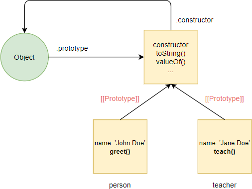
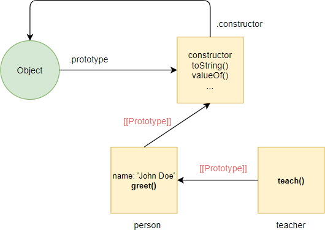

# JavaScript Prototypal Inheritance

- If you’ve worked with other object-oriented programming languages such as Java or C++, you’ve been familiar with the inheritance concept.

- In this programming paradigm, a class is a blueprint for creating objects. If you want a new class to reuse the functionality of an existing class, you can create a new class that extends the existing class. This is called classical inheritance.

- JavaScript doesn’t use classical inheritance. Instead, it uses prototypal inheritance.

`In prototypal inheritance, an object “inherits” properties from another object via the prototype linkage.`

## JavaScript prototypal inheritance and **proto**

> > The following defines a person object:

```js
let person = {
  name: "John Doe",
  greet: function () {
    return "Hi, I'm " + this.name;
  },
};
```

- By default, JavaScript provides you with an Object() function and a prototype object that can be accessed via the prototype property of the Object() function:

`When you use the object literal syntax to define an object, the object is an instance of the Object.`

- Therefore, the expression person instanceof Object returns true:

```js
console.log(person instanceof Object); // true
```

- The person object also links to the Object.prototype via the [[prototype]] linkage.
- In other words, you can access any properties of the Object.prototype object via the person object.

```js
console.log(person.toString());
```

#### Output

```js
[object Object]
```

`The [object Object] is the default conversion from an object to string.`

- To access the prototype of the person object, you can use its **proto** property:

```js
console.log(person.__proto__); // [Object: null prototype] {}
```

> > The following defines another object called teacher. The teacher object has the teach() method:

```js
let teacher = {
  teach: function (subject) {
    return "I can teach " + subject;
  },
};
```



- If you want the teacher object to access all properties of the person object, you can set the prototype of teacher object to the person object:

```js
teacher.__proto__ = person;
```



`Note that you should never use the __proto__ in the production code. This is just for learning and understanding purposes.`

- In JavaScript, we say that the teacher object inherits properties of the person object. And this is prototypal inheritance.

## A standard way to implement prototypal inheritance in ES5

- ES5 provided a standard way to work with prototypal inheritance by using the Object.create() method.

`Note that now you should use the newer ES6 class and extends keywords to implement inheritance. It’s much simpler.`

- The Object.create() method creates a new object and uses an existing object as a prototype of the new object:

```js
Object.create(proto, [propertiesObject]);
```

> > The following creates an empty teacher object with the **proto** of the person object:

```js
let teacher = Object.create(person);
```

- After that, you can define properties for the teacher object:

```js
teacher.name = "Jane Doe";
teacher.teach = function (subject) {
  return "I can teach " + subject;
};
```

- Or you can do all of these steps in one statement as follows:

```js
let teacher = Object.create(person, {
  name: { value: "John Doe" },
  teach: {
    value: function (subject) {
      return "I can teach " + subject;
    },
  },
});
```

- ES5 also introduced the Object.getPrototypeOf() method that returns the prototype of an object. For example:

```js
console.log(Object.getPrototypeOf(teacher) === person); // true
```
