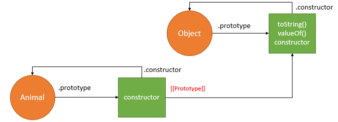

## Creating a JavaScript Object:

- Ways to create new objects:
  1.  using an object literal.
  2.  By creating instance of Object(in-build) directly (using new keyword)
  3.  **Factory pattern** to create object
  4.  **Constructor pattern** to create object
  5.  **Prototype pattern** to create object
  6.  **Constructor/Prototype pattern** to create object

## METHOD 1: Creating object by object literal

- The object literal is one of the most popular patterns for creating objects in JavaScript because of its simplicity.
- ES6 makes the object literal more succinct and powerful by extending the syntax in some ways.

#### **SYNTAX**

```js
  object={property1:value1,property2:value2.....propertyN:valueN}
```

- An object like this is referred to as an object literal — we've literally written out the object contents as we've come to create it.
- Sending a single object is much more efficient than sending several items individually, and it is easier to work with than an array, when you want to identify individual items by name.

`The object literal syntax is convenient for creating a single object. `

## Object property initializer shorthand

- Prior to ES6, an object literal is a collection of name-value pairs. For example:

```js
function createMachine(name, status) {
  return {
    name: name,
    status: status,
  };
}
```

This syntax looks redundant because name and status mentioned twice in both the name and value of properties.

- ES6 allows you to eliminate the duplication when a property of an object is the same as the local variable name by including the name without a colon and value.

```js
function createMachine(name, status) {
  return {
    name,
    status,
  };
}
```

---

## METHOD 2: Creating object using Object() Constructor

- First of all, you can use the Object() constructor to create a new object.
- Yes, even generic objects have a constructor, which generates an empty object.

```js
let person1 = new Object();

person1.name = "Chris";
person1["age"] = 38;
person1.greeting = function () {
  console.log(`Hi! I'm ${this.name}.`);
};
```

- You can also **pass an object literal** to the Object() constructor as a parameter, to prefill it with properties/methods.

```js
let person1 = new Object({
  name: "Chris",
  age: 38,
  greeting: function () {
    alert("Hi! I'm " + this.name + ".");
  },
});
```

---

## METHOD 3: Factory pattern to create object

- The factory pattern uses a function to abstract away the process of creating specific objects.

> **For example, the following createAnimal() function encapsulates the logic of creating the animal object.**

```js
// factory pattern- before the days of constructor function
function createAnimal(name) {
  var o = new Object();
  o.name = name;
  o.identify = function () {
    console.log("I'm " + o.name);
  };
  return o;
}
```

> To create a new object, you just need to call this function and pass the name argument as follows:

```js
var tom = createAnimal("Tom");
var jerry = createAnimal("Jerry");

tom.identify(); // I'm Tom
jerry.identify(); // I'm Jerry
```

`Although the factory pattern can create multiple similar objects, it doesn’t allow you to identify the type of object it creates.`

---

## METHOD 4: Constructor pattern to create object

- JavaScript allows you to create a custom constructor function that defines the properties and methods of user-defined objects.

```js
function Animal(name) {
  this.name = name;
  this.identify = function () {
    console.log("I'm " + this.name);
  };
}
```

- Unlike the factory pattern, the properties and methods of the animal object are assigned directly to the this object inside the constructor function.
- **At this point,** JavaScript engine creates the **Animal() function** and an **anonymous object.**
- The **Animal() function** has the **prototype property reference an anonymous object** and the **anonymous object has the constructor property reference the Animal() function.**
- In addition, the JavaScript engine **links the anonymous object to the Object.**
  
- To create a **new instance** of Animal, you use the new operator.

```js
var donald = new Animal("Donald");
```

- **Behind the scenes,** JavaScript executes these **four steps:**

  1. Create a new object.
  2. Set the **_this_** value of the constructor to the new object.// this = {}
  3. Execute code inside the constructor i.e., adding properties to the new object.
  4. Return the new object(return **_this_**).

  

```js
console.log(donald.constructor === Animal); // true
```

- In this example, because the **donald object** does not have the **constructor property,** JavaScript engine follows the prototype chain to find it in the **Animal.prototype object.**
- It found the **constructor property** in the **Animal.prototype object** and in this case the constructor property points to the **Animal() function**, therefore the statement above returns **true**.
- The donald object is also an instance of Animal and Object as follows:

```
console.log(donald instanceof Animal); // true
console.log(donald instanceof Object); // true
```

`The disadvantage of the constructor pattern is that the same method identify() is duplicated in each instance.`

```
var bob = new Animal('Bob');
```


`As you see, the identify() method is duplicated in both donald and bob objects. To solve this issue, you use the prototype pattern.`

---

## METHOD 5: Prototype pattern to create object

- The prototype pattern adds the properties of the object to the prototype object. Then, these properties are available and shared among all instances.

```
function Animal() {
    // properties are added to prototype
}

Animal.prototype.name = 'Noname';
Animal.prototype.identify = function() {
    console.log("I'm " + this.name);
}
```


```
var donald = new Animal();
donald.name = 'Donald'; // shadow the name property
donald.identify(); // I'm Donald
```


- JavaScript engine adds the name property to the donald object. As the result, both donald and Animal.prototype objects has the same name property.
- Inside the identify() method, the this object is set to the donald object, therefore this.name references to the name property of the donald object.
- Let’s remove the name property of the donald object.

```
delete donald.name;
```

- and call the identify() method again.

```
donald.identify(); //I'm Noname
```

- Now, JavaScript could not find the name property in the donald object, it follows the prototype chain and finds it in the Animal.prototype object. Hence, the this.name returns Noname.

## Method 6 : Constructor / Prototype pattern to create object

- The combination of the constructor and prototype patterns is the most common way to define custom types.
- The constructor pattern defines object properties, while the prototype pattern defines methods and shared properties.
- By using this pattern, all objects of the custom type share the method and each of them has its own properties. This constructor/prototype takes the best parts of both constructor and prototype patterns.

```js
function Animal(name) {
  this.name = name;
}

Animal.prototype.identify = function () {
  console.log("I'm " + this.name);
};

var donald = new Animal("Donald");
donald.identify(); // I'm Donald

var bob = new Animal("Bob");
bob.identify(); // I'm Bob
```


- JavaScript has a built-in method called create() that allows you to do that
- With it, you can create a new object, using an existing object as the prototype of the newly created object.

### **Object.create()**

```js
const book2 = Object.create(book1);
```

```js
console.log(book2); // Book {}
console.log(book2.__proto__); // Book { title: 'Book 1', author: 'John Doe', year: 2013 }
console.log(book2.__proto__.__proto__); // Book { getSummary: [λ], getAge: [λ] }
```

```js
console.log(book2.getSummary()); // Book 1 was written by John Doe in 2013
console.log(book2.getAge()); // Book 1 is 8 years old
```

- You'll see that book2 has been created based on book1 as its prototype —it has the same properties and method available to it.

#### **EXAMPLE**

```js
# We first create prototype

const BookProtos = {
  getSummary: function () {
    return `${this.title} was written by ${this.author} in ${this.year}`;
  }

   getAge: function () {
     const years = new Date().getFullYear() - this.year;
     return `${this.title} is ${years} years old `;
   },
};
```

```js
const book1 = Object.create(BookProtos);
```

```js
console.log(book1); // {}
console.log(book1.__proto__); //   { getSummary: [λ: getSummary], getAge: [λ: getAge] }
```

```js
book1.title = "book 1";
book1.author = "prabhash";
book1.year = "2013";
```

```js
console.log(book1); // { title: 'book 1', author: 'prabhash', year: '2013' }
console.log(book1.getSummary()); // book 1 was written by prabhash in 2013
```

- We can do same things in short too

```js
const book1 = Object.create(BookProtos, {
  title: { value: "book 1" },
  author: { value: "prabhash" },
  year: { value: "2013" },
});
```

- We can make above example better by makking inti() fuunction inside the prototype. It will look similar to constructor function, but its not

```js
const BookProtos = {
  getSummary: function () {
    return `${this.title} was written by ${this.author} in ${this.year}`;
  },

  getAge: function () {
    const years = new Date().getFullYear() - this.year;
    return `${this.title} is ${years} years old `;
  },

  init(title, author, year) {
    this.title = title;
    this.author = author;
    this.year = year;
  },
};

const book1 = Object.create(BookProtos); // creating connection
book1.init("book1", "Prabhash", "2021"); // accessing the prototype method to initialize

console.log(book1); //{ title: 'book1', author: 'Prabhash', year: '2021' }
```
