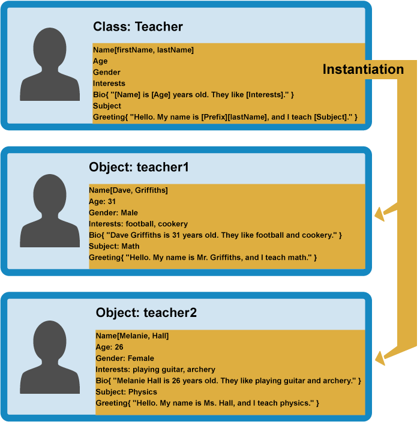

# Object-oriented JavaScript

## What is Object orianted programming?

- OOP is a programming paradigm(style of the code-how we write and organize the code) based on concept of objects

- we use objects to model(describe) real-world or abstract features.

- objects may contain data(properties) and code(methods) .By using objects, we pack "data and corresponding behavior" into one block.

- In OOP, objects are self-contained pieces/blocks of code.

- Objects are "building blocks" of our applications, and interect with one another.

- Interection happen through a "public interface"(API): Methods that the code "outside" of the object can access and use to communicate with the object.

- OOP was developed with the goal of organizing code, to make it more flexible and easier to maintain(avoid "spaghetti code")

- The basic idea of OOP is that we use objects to model real world things that we want to represent inside our programs, and/or provide a simple way to access functionality that would otherwise be hard or impossible to make use of.
- Object data (and often, functions too) can be stored neatly (the official word is encapsulated) inside an object package (which can be given a specific name to refer to, which is sometimes called a namespace), making it easy to structure and access; objects are also commonly used as data stores that can be easily sent across the network.

## Defining an object template

- Let's consider a simple program that displays information about the students and teachers at a school.
- To start this off, we could return to our Person object type from our first objects article, which defines the generic data and functionality of a person
- There are lots of things you could know about a person (their address, height, shoe size, DNA profile, passport number, significant personality traits ...) , but in this case we are only interested in showing their name, age, gender, and interests, and we also want to be able to write a short introduction about them based on this data, and get them to say hello.
- This is known as **_abstraction_** — creating a simple model of a more complex thing, which represents its most important aspects in a way that is easy to work with for our program's purposes.


## Creating actual objects

- From our class, we can create object instances — objects that contain the data and functionality defined in the class. From our Person class, we can now create some actual people:


- When an object instance is created from a class, the class's constructor function is run to create it.
- This process of creating an object instance from a class is called **_instantiation _** — the object instance is instantiated from the class.

## Specialist classes

- In this case we don't want generic people — we want teachers and students, which are both more specific types of people.
- In OOP, we can create new classes based on other classes — these new child classes (also known as subclasses) can be made to inherit the data and code features of their parent class, so you can reuse functionality common to all the object types rather than having to duplicate it.
- Where functionality differs between classes, you can define specialized features directly on them as needed.
  

```
Note: The fancy word for the ability of multiple object types to implement the same functionality is polymorphism.
```

- You can now create object instances from your child classes. For example:
  
